# Build a Serverless Web Application
with AWS Lambda, Amazon API Gateway, AWS Amplify, Amazon DynamoDB, and Amazon Cognito


## **Overview**

Create a simple serverless web application that enables users to request unicorn rides from the [Wild Rydes](http://www.wildrydes.com/) fleet. The application will present users with an HTML-based user interface for indicating the location where they would like to be picked up and will interact with a RESTful web service on the backend to submit the request and dispatch a nearby unicorn. The application will also provide facilities for users to register with the service and log in before requesting rides.


## Prerequisites

- AWS CLI
- ArcGIS
- Notepad++
- Chrome
- AWS Lambda
- Amazon API Gateway
- AWS Amplify
- Amazon DynamoDB
- Amazon Cognito

## **Application architecture**

The application use AWS Amplify, Amazon Cognito, AWS Lambda, Amazon DynamoDB, Amazon API Gateway. 

Amplify Console provides continuous deployment and hosting of the static web resources including HTML, CSS, JavaScript, and image files which are loaded in the user's browser. 

JavaScript executed in the browser sends and receives data from a public backend API built using Lambda and API Gateway. 

Amazon Cognito provides user management and authentication functions to secure the backend API. Finally, DynamoDB provides a persistence layer where data can be stored by the API's Lambda function.


**Step 1: Static Web Hosting**

AWS Amplify hosts static web resources including HTML, CSS, JavaScript, and image files which are loaded in the user's browser.


**Step 2: User Management**

Amazon Cognito provides user management and authentication functions to secure the backend API.


**Step 3: Serverless Backend**

Amazon DynamoDB provides a persistence layer where data can be stored by the API's Lambda function.


**Step 4: RESTful API**

JavaScript executed in the browser sends and receives data from a public backend API built using Lambda and API Gateway.


(After this lab practice, Terminate all the resources you created throughout this lab.)


## **Part 1: Static Web Hosting with Continuous Deployment**

In static web content including HTML, CSS, JavaScript, images, and other files that will be managed by AWS Amplify console. End users will access to site using public website URL which exposed by AWS Amplify console. It’s no need to run any web servers or use other services to make site available.


## **Implementation**

**Select a region**

Choose **US East (N. Virginia)** region.

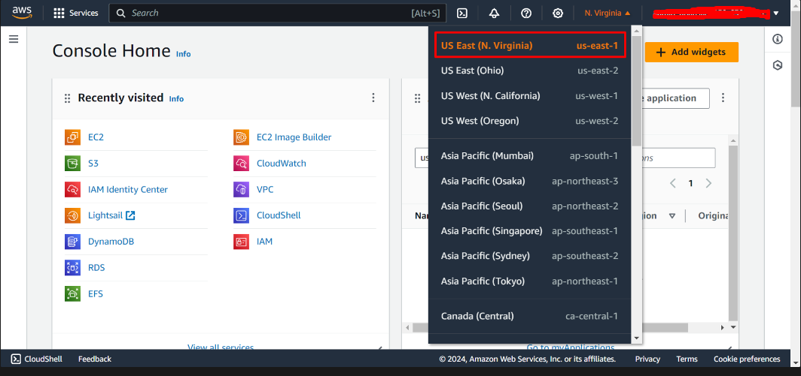


**Create Git repository**

Install AWS CLI

AWS CLI install by following reference.

https://docs.aws.amazon.com/cli/latest/userguide/getting-started-install.html


Open AWS CodeCommit console


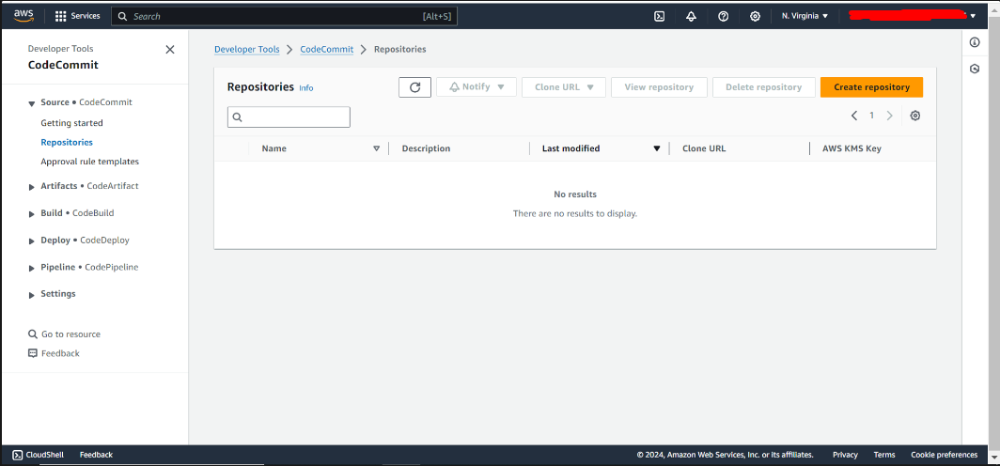


Create repository

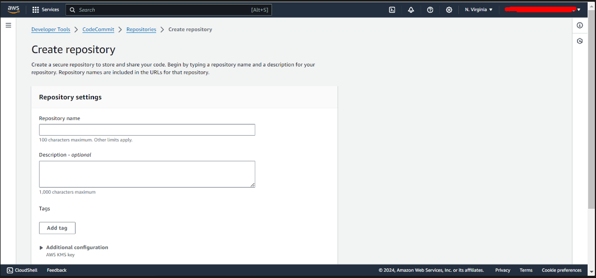


Enter **wildrydes-site** for the **Repository name**.

Choose create

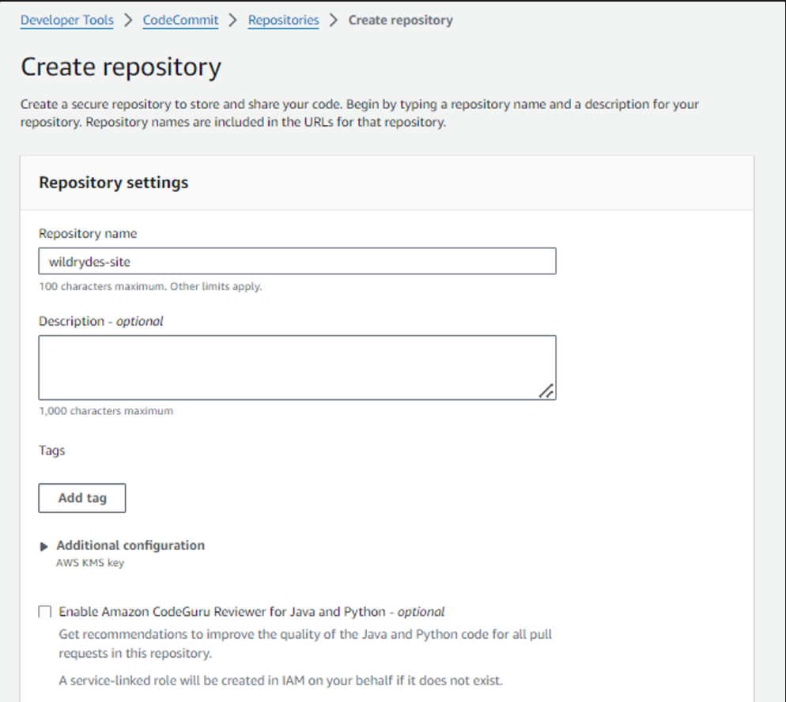


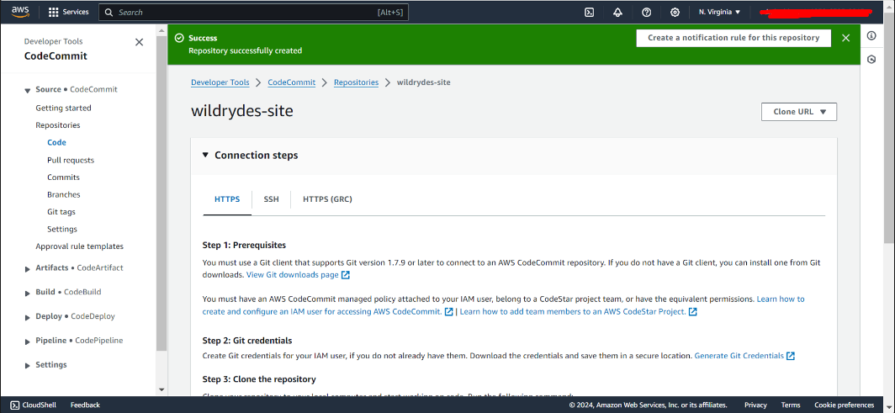


Once repository is created, set up an IAM user with Git credentials in the IAM console.


Important note

Create Access keys in the IAM > Security Credentials tab. Download the Access Key and Secret Access Key IDs or copy and save them in a secure location.

Generate HTTPS Git credentials for AWS CodeCommit. Download or save these generated credentials as well.


In the terminal window used to install AWS CLI, enter the command: aws configure

Enter the **AWS Access Key ID** and **Secret Access Key** previously created.

For **Default region name** enter the Region you initially selected to create your CodeCommit repository in.

Leave **Default output format** blank, and press enter.

The code block show in windows terminal.


Set up the git config credential helper in the terminal window.

For Windows


```bash
git config --global credential.helper "!aws codecommit credential-helper $@"
git config --global credential.UseHttpPath true
```

Result show as following in .gitconfig file;


```
[credential]
	helper = !aws codecommit credential-helper $@
	UseHttpPath = true
```


Navigate back to the AWS CodeCommit console and select the wildrydes-site repository.

Select **Clone HTTPS** from the **Clone URL** dropdown to copy the HTTPS URL.


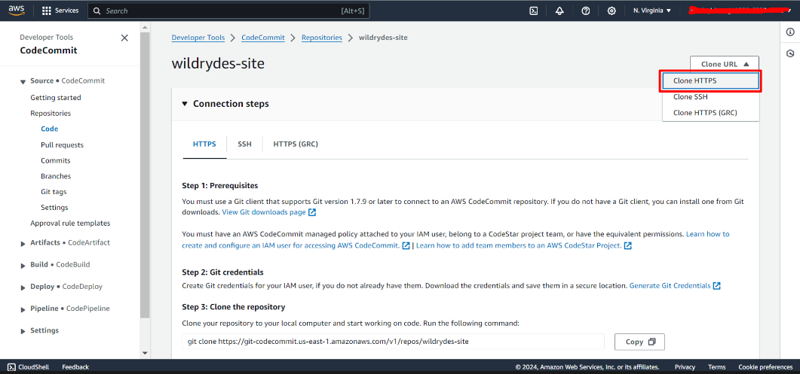


From your terminal window run git clone and paste the HTTPS URL of the repository.


```bash
git clone https://git-codecommit.us-east-1.amazonaws.com/v1/repos/wildrydes-site
```


The following code block is an example of what you will see in your terminal window:


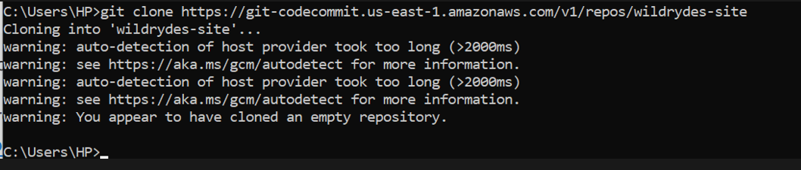


There will be a warning that you appear to have cloned an empty repository, this is expected.

**Populate the git repository**

Change directory into your repository and copy the static files from S3 using the following commands


```bash
cd wildrydes-site

aws s3 cp s3://wildrydes-us-east-1/WebApplication/1_StaticWebHosting/website ./ --recursive
```


If S3 not working properly, please use attached lab repository file.


```
C:\Users\HP>cd wildrydes-site

C:\Users\HP\wildrydes-site>aws s3 cp s3://wildrydes-us-east-1/WebApplication/1_StaticWebHosting/website ./ --recursive
download: s3://wildrydes-us-east-1/WebApplication/1_StaticWebHosting/website/css/message.css to css\message.css
download: s3://wildrydes-us-east-1/WebApplication/1_StaticWebHosting/website/css/font.css to css\font.css
download: s3://wildrydes-us-east-1/WebApplication/1_StaticWebHosting/website/apply.html to .\apply.html
download: s3://wildrydes-us-east-1/WebApplication/1_StaticWebHosting/website/css/ride.css to css\ride.css
download: s3://wildrydes-us-east-1/WebApplication/1_StaticWebHosting/website/favicon.ico to .\favicon.ico
download: s3://wildrydes-us-east-1/WebApplication/1_StaticWebHosting/website/fonts/glyphicons-halflings-regular.eot to fonts\glyphicons-halflings-regular.eot
download: s3://wildrydes-us-east-1/WebApplication/1_StaticWebHosting/website/css/index.css to css\index.css
download: s3://wildrydes-us-east-1/WebApplication/1_StaticWebHosting/website/css/mapbox-gl.css to css\mapbox-gl.css
download: s3://wildrydes-us-east-1/WebApplication/1_StaticWebHosting/website/fonts/fairplex-wide-n4.woff to fonts\fairplex-wide-n4.woff
download: s3://wildrydes-us-east-1/WebApplication/1_StaticWebHosting/website/faq.html to .\faq.html
download: s3://wildrydes-us-east-1/WebApplication/1_StaticWebHosting/website/css/main.css to css\main.css
download: s3://wildrydes-us-east-1/WebApplication/1_StaticWebHosting/website/fonts/fairplex-wide-n7.woff to fonts\fairplex-wide-n7.woff
download: s3://wildrydes-us-east-1/WebApplication/1_StaticWebHosting/website/fonts/glyphicons-halflings-regular.woff2 to fonts\glyphicons-halflings-regular.woff2
download: s3://wildrydes-us-east-1/WebApplication/1_StaticWebHosting/website/images/logo.png to images\logo.png
download: s3://wildrydes-us-east-1/WebApplication/1_StaticWebHosting/website/css/normalize.css to css\normalize.css
download: s3://wildrydes-us-east-1/WebApplication/1_StaticWebHosting/website/images/bbd3207c.png to images\bbd3207c.png
download: s3://wildrydes-us-east-1/WebApplication/1_StaticWebHosting/website/images/loading.gif to images\loading.gif
download: s3://wildrydes-us-east-1/WebApplication/1_StaticWebHosting/website/fonts/glyphicons-halflings-regular.woff to fonts\glyphicons-halflings-regular.woff
download: s3://wildrydes-us-east-1/WebApplication/1_StaticWebHosting/website/images/star-pattern.png to images\star-pattern.png
download: s3://wildrydes-us-east-1/WebApplication/1_StaticWebHosting/website/css/bootstrap.min.css to css\bootstrap.min.css
download: s3://wildrydes-us-east-1/WebApplication/1_StaticWebHosting/website/images/unicorn-icon.png to images\unicorn-icon.png
download: s3://wildrydes-us-east-1/WebApplication/1_StaticWebHosting/website/images/background.png to images\background.png
download: s3://wildrydes-us-east-1/WebApplication/1_StaticWebHosting/website/fonts/glyphicons-halflings-regular.svg to fonts\glyphicons-halflings-regular.svg
download: s3://wildrydes-us-east-1/WebApplication/1_StaticWebHosting/website/images/spinning-gears.gif to images\spinning-gears.gif
download: s3://wildrydes-us-east-1/WebApplication/1_StaticWebHosting/website/images/unicorn-map-bg.png to images\unicorn-map-bg.png
download: s3://wildrydes-us-east-1/WebApplication/1_StaticWebHosting/website/images/unicorn-logo.png to images\unicorn-logo.png
download: s3://wildrydes-us-east-1/WebApplication/1_StaticWebHosting/website/images/wr-home-W.png to images\wr-home-W.png
download: s3://wildrydes-us-east-1/WebApplication/1_StaticWebHosting/website/fonts/glyphicons-halflings-regular.ttf to fonts\glyphicons-halflings-regular.ttf
download: s3://wildrydes-us-east-1/WebApplication/1_StaticWebHosting/website/images/wr-home-apple.png to images\wr-home-apple.png
download: s3://wildrydes-us-east-1/WebApplication/1_StaticWebHosting/website/images/wr-home-block-2.png to images\wr-home-block-2.png
download: s3://wildrydes-us-east-1/WebApplication/1_StaticWebHosting/website/images/wr-home-block-1.png to images\wr-home-block-1.png
download: s3://wildrydes-us-east-1/WebApplication/1_StaticWebHosting/website/images/wr-home-blackberry.png to images\wr-home-blackberry.png
download: s3://wildrydes-us-east-1/WebApplication/1_StaticWebHosting/website/images/wr-home-block-3.png to images\wr-home-block-3.png
download: s3://wildrydes-us-east-1/WebApplication/1_StaticWebHosting/website/images/wr-home-instagram.png to images\wr-home-instagram.png
download: s3://wildrydes-us-east-1/WebApplication/1_StaticWebHosting/website/images/wr-home-facebook.png to images\wr-home-facebook.png
download: s3://wildrydes-us-east-1/WebApplication/1_StaticWebHosting/website/images/wr-home-google.png to images\wr-home-google.png
download: s3://wildrydes-us-east-1/WebApplication/1_StaticWebHosting/website/images/wr-home-block-4.png to images\wr-home-block-4.png
download: s3://wildrydes-us-east-1/WebApplication/1_StaticWebHosting/website/images/wr-home-Xiaomi.png to images\wr-home-Xiaomi.png
download: s3://wildrydes-us-east-1/WebApplication/1_StaticWebHosting/website/images/wr-home-about.jpg to images\wr-home-about.jpg
download: s3://wildrydes-us-east-1/WebApplication/1_StaticWebHosting/website/images/wr-faq-header.jpg to images\wr-faq-header.jpg
download: s3://wildrydes-us-east-1/WebApplication/1_StaticWebHosting/website/images/wr-home-kraken.png to images\wr-home-kraken.png
download: s3://wildrydes-us-east-1/WebApplication/1_StaticWebHosting/website/images/wr-home-twitter.png to images\wr-home-twitter.png
download: s3://wildrydes-us-east-1/WebApplication/1_StaticWebHosting/website/images/wr-home-wechat.png to images\wr-home-wechat.png
download: s3://wildrydes-us-east-1/WebApplication/1_StaticWebHosting/website/images/shadowfox.png to images\shadowfox.png
download: s3://wildrydes-us-east-1/WebApplication/1_StaticWebHosting/website/images/wr-home-top.jpg to images\wr-home-top.jpg
download: s3://wildrydes-us-east-1/WebApplication/1_StaticWebHosting/website/images/wr-home-weibo.png to images\wr-home-weibo.png
download: s3://wildrydes-us-east-1/WebApplication/1_StaticWebHosting/website/images/wr-investors-1.png to images\wr-investors-1.png
download: s3://wildrydes-us-east-1/WebApplication/1_StaticWebHosting/website/images/wr-investors-3.png to images\wr-investors-3.png
download: s3://wildrydes-us-east-1/WebApplication/1_StaticWebHosting/website/css/bootstrap.min.css.map to css\bootstrap.min.css.map
download: s3://wildrydes-us-east-1/WebApplication/1_StaticWebHosting/website/images/wr-investors-awesome.png to images\wr-investors-awesome.png
download: s3://wildrydes-us-east-1/WebApplication/1_StaticWebHosting/website/images/wr-investors-5.png to images\wr-investors-5.png
download: s3://wildrydes-us-east-1/WebApplication/1_StaticWebHosting/website/images/wr-investors-2.png to images\wr-investors-2.png
download: s3://wildrydes-us-east-1/WebApplication/1_StaticWebHosting/website/images/wr-investors-4.png to images\wr-investors-4.png
download: s3://wildrydes-us-east-1/WebApplication/1_StaticWebHosting/website/images/wr-investors-pcp.png to images\wr-investors-pcp.png
download: s3://wildrydes-us-east-1/WebApplication/1_StaticWebHosting/website/images/wr-investors-thebarn.png to images\wr-investors-thebarn.png
download: s3://wildrydes-us-east-1/WebApplication/1_StaticWebHosting/website/images/wr-logo-white.png to images\wr-logo-white.png
download: s3://wildrydes-us-east-1/WebApplication/1_StaticWebHosting/website/images/wr-logo-black.png to images\wr-logo-black.png
download: s3://wildrydes-us-east-1/WebApplication/1_StaticWebHosting/website/images/rocinante.png to images\rocinante.png
download: s3://wildrydes-us-east-1/WebApplication/1_StaticWebHosting/website/images/wr-unicorn-one.png to images\wr-unicorn-one.png
download: s3://wildrydes-us-east-1/WebApplication/1_StaticWebHosting/website/index.html to .\index.html
download: s3://wildrydes-us-east-1/WebApplication/1_StaticWebHosting/website/investors.html to .\investors.html
download: s3://wildrydes-us-east-1/WebApplication/1_StaticWebHosting/website/js/cognito-auth.js to js\cognito-auth.js
download: s3://wildrydes-us-east-1/WebApplication/1_StaticWebHosting/website/js/esri-map.js to js\esri-map.js
download: s3://wildrydes-us-east-1/WebApplication/1_StaticWebHosting/website/js/config.js to js\config.js
download: s3://wildrydes-us-east-1/WebApplication/1_StaticWebHosting/website/js/ride.js to js\ride.js
download: s3://wildrydes-us-east-1/WebApplication/1_StaticWebHosting/website/js/main.js to js\main.js
download: s3://wildrydes-us-east-1/WebApplication/1_StaticWebHosting/website/js/vendor.js to js\vendor.js
download: s3://wildrydes-us-east-1/WebApplication/1_StaticWebHosting/website/images/unicorn-silhouette.png to images\unicorn-silhouette.png
download: s3://wildrydes-us-east-1/WebApplication/1_StaticWebHosting/website/images/wr-unicorn-header.png to images\wr-unicorn-header.png
download: s3://wildrydes-us-east-1/WebApplication/1_StaticWebHosting/website/js/vendor/amazon-cognito-identity.min.js to js\vendor\amazon-cognito-identity.min.js
download: s3://wildrydes-us-east-1/WebApplication/1_StaticWebHosting/website/js/vendor/bootstrap.min.js to js\vendor\bootstrap.min.js
download: s3://wildrydes-us-east-1/WebApplication/1_StaticWebHosting/website/js/vendor/html5shiv.min.js to js\vendor\html5shiv.min.js
download: s3://wildrydes-us-east-1/WebApplication/1_StaticWebHosting/website/js/vendor/moment.min.js to js\vendor\moment.min.js
download: s3://wildrydes-us-east-1/WebApplication/1_StaticWebHosting/website/js/vendor/aws-cognito-sdk.min.js to js\vendor\aws-cognito-sdk.min.js
download: s3://wildrydes-us-east-1/WebApplication/1_StaticWebHosting/website/js/vendor/modernizr.js to js\vendor\modernizr.js
download: s3://wildrydes-us-east-1/WebApplication/1_StaticWebHosting/website/js/vendor/respond.min.js to js\vendor\respond.min.js
download: s3://wildrydes-us-east-1/WebApplication/1_StaticWebHosting/website/ride.html to .\ride.html
download: s3://wildrydes-us-east-1/WebApplication/1_StaticWebHosting/website/images/wr-investors-header.png to images\wr-investors-header.png
download: s3://wildrydes-us-east-1/WebApplication/1_StaticWebHosting/website/robots.txt to .\robots.txt
download: s3://wildrydes-us-east-1/WebApplication/1_StaticWebHosting/website/images/bucephalus.png to images\bucephalus.png
download: s3://wildrydes-us-east-1/WebApplication/1_StaticWebHosting/website/signin.html to .\signin.html
download: s3://wildrydes-us-east-1/WebApplication/1_StaticWebHosting/website/register.html to .\register.html
download: s3://wildrydes-us-east-1/WebApplication/1_StaticWebHosting/website/verify.html to .\verify.html
download: s3://wildrydes-us-east-1/WebApplication/1_StaticWebHosting/website/unicorns.html to .\unicorns.html
download: s3://wildrydes-us-east-1/WebApplication/1_StaticWebHosting/website/js/vendor/unicorn-icon to js\vendor\unicorn-icon
download: s3://wildrydes-us-east-1/WebApplication/1_StaticWebHosting/website/images/wr-unicorn-two.png to images\wr-unicorn-two.png
download: s3://wildrydes-us-east-1/WebApplication/1_StaticWebHosting/website/images/wr-unicorn-three.png to images\wr-unicorn-three.png
download: s3://wildrydes-us-east-1/WebApplication/1_StaticWebHosting/website/images/wr-apply-header.png to images\wr-apply-header.png
download: s3://wildrydes-us-east-1/WebApplication/1_StaticWebHosting/website/js/vendor/jquery-3.1.0.js to js\vendor\jquery-3.1.0.js
download: s3://wildrydes-us-east-1/WebApplication/1_StaticWebHosting/website/images/wr-home-quote.jpg to images\wr-home-quote.jpg
download: s3://wildrydes-us-east-1/WebApplication/1_StaticWebHosting/website/images/wr-home-quote.png to images\wr-home-quote.png

C:\Users\HP\wildrydes-site>
```


Add, commit, and push the git files.


```bash
git add .
git commit -m "new files"
git push
```


Show result as below;

```
C:\Users\HP\wildrydes-site>git add
Nothing specified, nothing added.
hint: Maybe you wanted to say 'git add .'?
hint: Turn this message off by running
hint: "git config advice.addEmptyPathspec false"

C:\Users\HP\wildrydes-site>git add .
warning: in the working copy of 'apply.html', LF will be replaced by CRLF the next time Git touches it
warning: in the working copy of 'css/bootstrap.min.css', LF will be replaced by CRLF the next time Git touches it
warning: in the working copy of 'css/font.css', LF will be replaced by CRLF the next time Git touches it
warning: in the working copy of 'css/index.css', LF will be replaced by CRLF the next time Git touches it
warning: in the working copy of 'css/main.css', LF will be replaced by CRLF the next time Git touches it
warning: in the working copy of 'css/mapbox-gl.css', LF will be replaced by CRLF the next time Git touches it
warning: in the working copy of 'css/message.css', LF will be replaced by CRLF the next time Git touches it
warning: in the working copy of 'css/normalize.css', LF will be replaced by CRLF the next time Git touches it
warning: in the working copy of 'css/ride.css', LF will be replaced by CRLF the next time Git touches it
warning: in the working copy of 'faq.html', LF will be replaced by CRLF the next time Git touches it
warning: in the working copy of 'fonts/glyphicons-halflings-regular.svg', LF will be replaced by CRLF the next time Git touches it
warning: in the working copy of 'index.html', LF will be replaced by CRLF the next time Git touches it
warning: in the working copy of 'investors.html', LF will be replaced by CRLF the next time Git touches it
warning: in the working copy of 'js/cognito-auth.js', LF will be replaced by CRLF the next time Git touches it
warning: in the working copy of 'js/config.js', LF will be replaced by CRLF the next time Git touches it
warning: in the working copy of 'js/esri-map.js', LF will be replaced by CRLF the next time Git touches it
warning: in the working copy of 'js/ride.js', LF will be replaced by CRLF the next time Git touches it
warning: in the working copy of 'js/vendor.js', LF will be replaced by CRLF the next time Git touches it
warning: in the working copy of 'js/vendor/amazon-cognito-identity.min.js', LF will be replaced by CRLF the next time Git touches it
warning: in the working copy of 'js/vendor/aws-cognito-sdk.min.js', LF will be replaced by CRLF the next time Git touches it
warning: in the working copy of 'js/vendor/bootstrap.min.js', LF will be replaced by CRLF the next time Git touches it
warning: in the working copy of 'js/vendor/html5shiv.min.js', LF will be replaced by CRLF the next time Git touches it
warning: in the working copy of 'js/vendor/jquery-3.1.0.js', LF will be replaced by CRLF the next time Git touches it
warning: in the working copy of 'js/vendor/moment.min.js', LF will be replaced by CRLF the next time Git touches it
warning: in the working copy of 'js/vendor/respond.min.js', LF will be replaced by CRLF the next time Git touches it
warning: in the working copy of 'register.html', LF will be replaced by CRLF the next time Git touches it
warning: in the working copy of 'ride.html', LF will be replaced by CRLF the next time Git touches it
warning: in the working copy of 'robots.txt', LF will be replaced by CRLF the next time Git touches it
warning: in the working copy of 'signin.html', LF will be replaced by CRLF the next time Git touches it
warning: in the working copy of 'unicorns.html', LF will be replaced by CRLF the next time Git touches it
warning: in the working copy of 'verify.html', LF will be replaced by CRLF the next time Git touches it

C:\Users\HP\wildrydes-site>git commit -m "new files"
[master (root-commit) 3c2c445] new files
 91 files changed, 13680 insertions(+)
 create mode 100644 apply.html
 create mode 100644 css/bootstrap.min.css
 create mode 100644 css/bootstrap.min.css.map
 create mode 100644 css/font.css
 create mode 100644 css/index.css
 create mode 100644 css/main.css
 create mode 100644 css/mapbox-gl.css
 create mode 100644 css/message.css
 create mode 100644 css/normalize.css
 create mode 100644 css/ride.css
 create mode 100644 faq.html
 create mode 100644 favicon.ico
 create mode 100644 fonts/fairplex-wide-n4.woff
 create mode 100644 fonts/fairplex-wide-n7.woff
 create mode 100644 fonts/glyphicons-halflings-regular.eot
 create mode 100644 fonts/glyphicons-halflings-regular.svg
 create mode 100644 fonts/glyphicons-halflings-regular.ttf
 create mode 100644 fonts/glyphicons-halflings-regular.woff
 create mode 100644 fonts/glyphicons-halflings-regular.woff2
 create mode 100644 images/background.png
 create mode 100644 images/bbd3207c.png
 create mode 100644 images/bucephalus.png
 create mode 100644 images/loading.gif
 create mode 100644 images/logo.png
 create mode 100644 images/rocinante.png
 create mode 100644 images/shadowfox.png
 create mode 100644 images/spinning-gears.gif
 create mode 100644 images/star-pattern.png
 create mode 100644 images/unicorn-icon.png
 create mode 100644 images/unicorn-logo.png
 create mode 100644 images/unicorn-map-bg.png
 create mode 100644 images/unicorn-silhouette.png
 create mode 100644 images/wr-apply-header.png
 create mode 100644 images/wr-faq-header.jpg
 create mode 100644 images/wr-home-W.png
 create mode 100644 images/wr-home-Xiaomi.png
 create mode 100644 images/wr-home-about.jpg
 create mode 100644 images/wr-home-apple.png
 create mode 100644 images/wr-home-blackberry.png
 create mode 100644 images/wr-home-block-1.png
 create mode 100644 images/wr-home-block-2.png
 create mode 100644 images/wr-home-block-3.png
 create mode 100644 images/wr-home-block-4.png
 create mode 100644 images/wr-home-facebook.png
 create mode 100644 images/wr-home-google.png
 create mode 100644 images/wr-home-instagram.png
 create mode 100644 images/wr-home-kraken.png
 create mode 100644 images/wr-home-quote.jpg
 create mode 100644 images/wr-home-quote.png
 create mode 100644 images/wr-home-top.jpg
 create mode 100644 images/wr-home-twitter.png
 create mode 100644 images/wr-home-wechat.png
 create mode 100644 images/wr-home-weibo.png
 create mode 100644 images/wr-investors-1.png
 create mode 100644 images/wr-investors-2.png
 create mode 100644 images/wr-investors-3.png
 create mode 100644 images/wr-investors-4.png
 create mode 100644 images/wr-investors-5.png
 create mode 100644 images/wr-investors-awesome.png
 create mode 100644 images/wr-investors-header.png
 create mode 100644 images/wr-investors-pcp.png
 create mode 100644 images/wr-investors-thebarn.png
 create mode 100644 images/wr-logo-black.png
 create mode 100644 images/wr-logo-white.png
 create mode 100644 images/wr-unicorn-header.png
 create mode 100644 images/wr-unicorn-one.png
 create mode 100644 images/wr-unicorn-three.png
 create mode 100644 images/wr-unicorn-two.png
 create mode 100644 index.html
 create mode 100644 investors.html
 create mode 100644 js/cognito-auth.js
 create mode 100644 js/config.js
 create mode 100644 js/esri-map.js
 create mode 100644 js/main.js
 create mode 100644 js/ride.js
 create mode 100644 js/vendor.js
 create mode 100644 js/vendor/amazon-cognito-identity.min.js
 create mode 100644 js/vendor/aws-cognito-sdk.min.js
 create mode 100644 js/vendor/bootstrap.min.js
 create mode 100644 js/vendor/html5shiv.min.js
 create mode 100644 js/vendor/jquery-3.1.0.js
 create mode 100644 js/vendor/modernizr.js
 create mode 100644 js/vendor/moment.min.js
 create mode 100644 js/vendor/respond.min.js
 create mode 100644 js/vendor/unicorn-icon
 create mode 100644 register.html
 create mode 100644 ride.html
 create mode 100644 robots.txt
 create mode 100644 signin.html
 create mode 100644 unicorns.html
 create mode 100644 verify.html

C:\Users\HP\wildrydes-site>git push
Enumerating objects: 95, done.
Counting objects: 100% (95/95), done.
Delta compression using up to 8 threads
Compressing objects: 100% (94/94), done.
Writing objects: 100% (95/95), 9.44 MiB | 428.00 KiB/s, done.
Total 95 (delta 2), reused 0 (delta 0), pack-reused 0
remote: Validating objects: 100%
To https://git-codecommit.us-east-1.amazonaws.com/v1/repos/wildrydes-site
 * [new branch]      master -> master

C:\Users\HP\wildrydes-site>
```


If code commit error occur

https://docs.aws.amazon.com/codecommit/latest/userguide/setting-up-gc.html#setting-up-gc-account

**Enable web hosting with the AWS Amplify Console**


Launch the AWS Amplify console.

Choose Get Started.


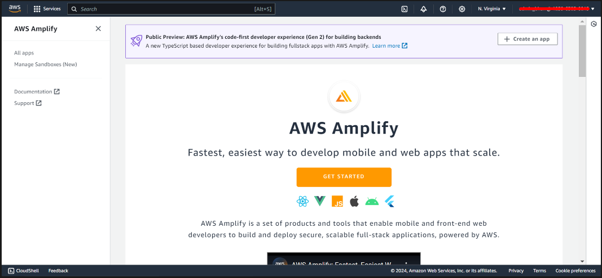


Under the Amplify Hosting Host your web app header, choose Get Started.


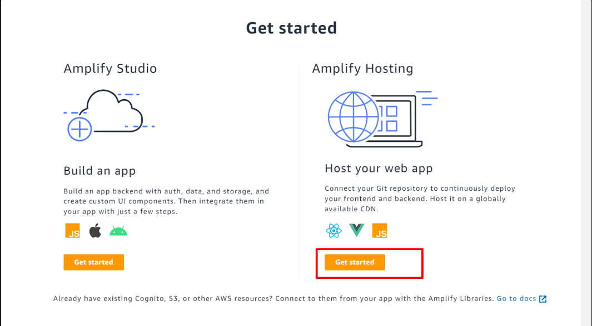


On the Get started with Amplify Hosting page, select AWS CodeCommit and choose Continue.


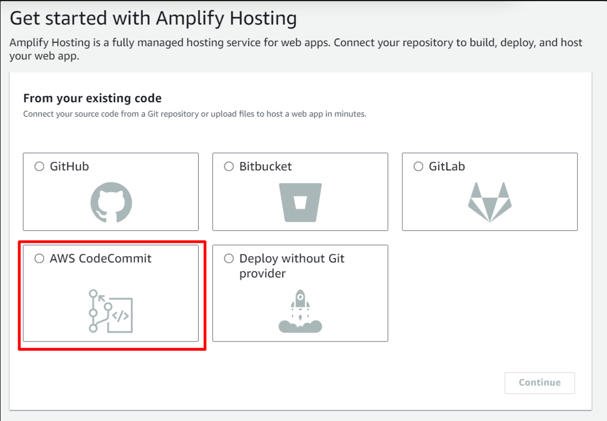


On the Add repository branch step, select wildrydes-site from the Select a repository dropdown.


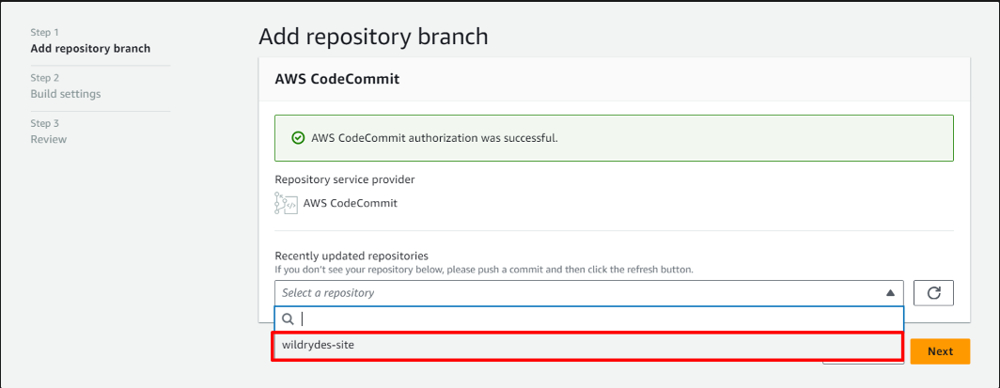


If you used GitHub, you'll need to authorize AWS Amplify to your GitHub account.

In the Branch dropdown select master and choose Next.


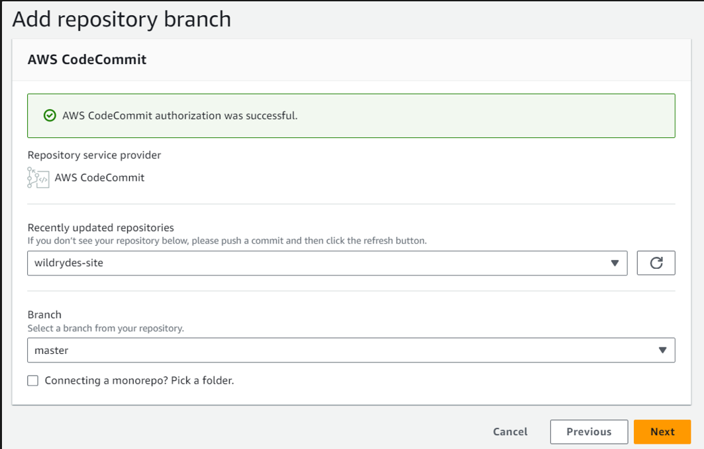


On the Build settings page, leave all the defaults, select Allow AWS Amplify to automatically deploy all files hosted in your project root directory and choose Next.


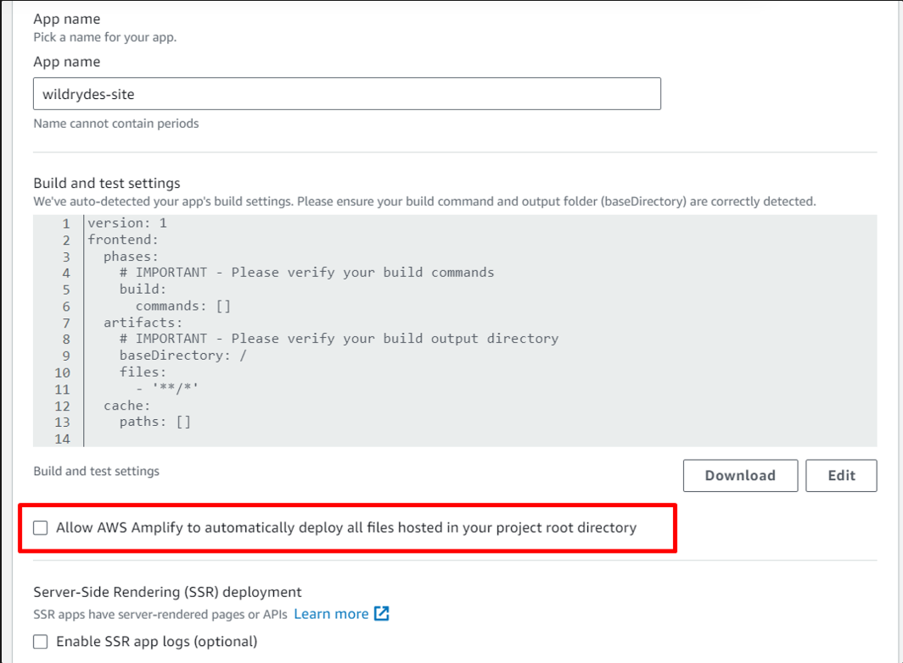


On the Review page select Save and deploy.

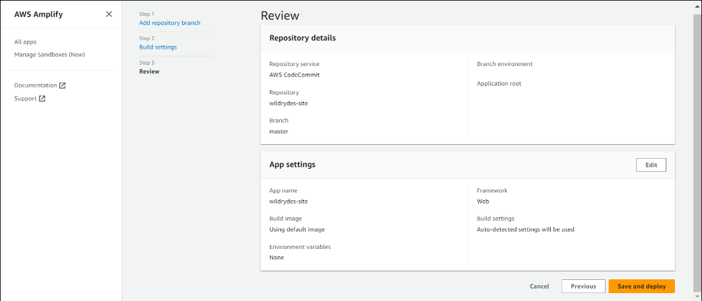


The process takes a couple of minutes for Amplify Console to create the necessary resources and to deploy code.

Once completed, select the site image, or the link underneath the thumbnail to launch Wild Rydes site. If select the link for **master** will see the build and deployment details related to branch.


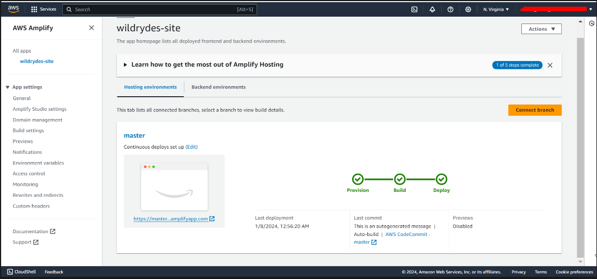


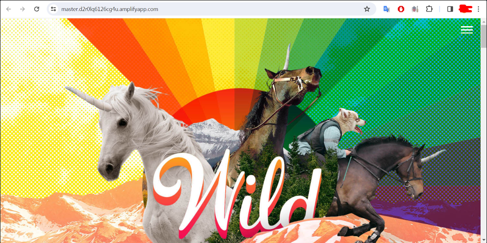


**Modify site**

The AWS Amplify console will rebuild and redeploy the app when it detects changes to the connected repository. Make a change to the main page to test out this process.

On local machine, navigate to the the wildrydes-site folder and open the index.html file in a text editor of choice.


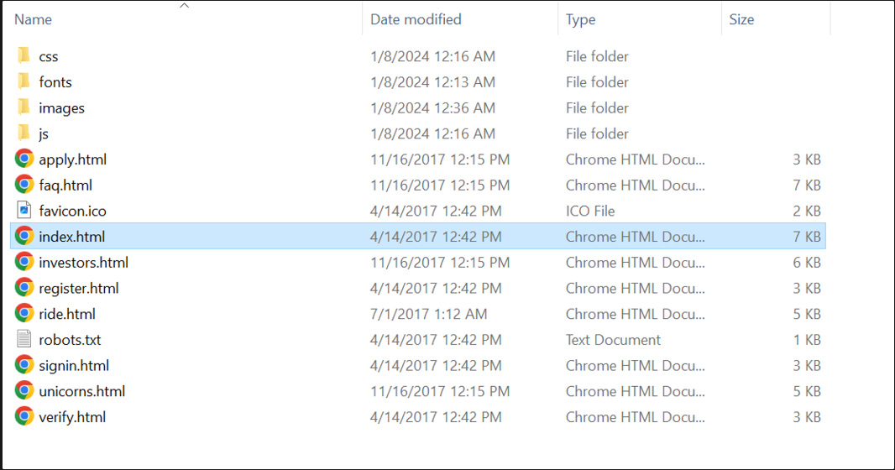


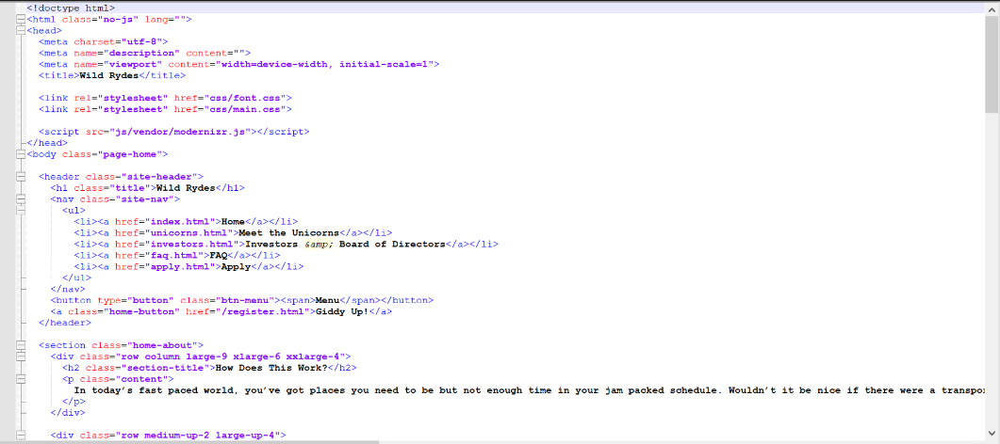


Modify the title line with the following text: <title>Wild Rydes - Rydes of the Future!</title>


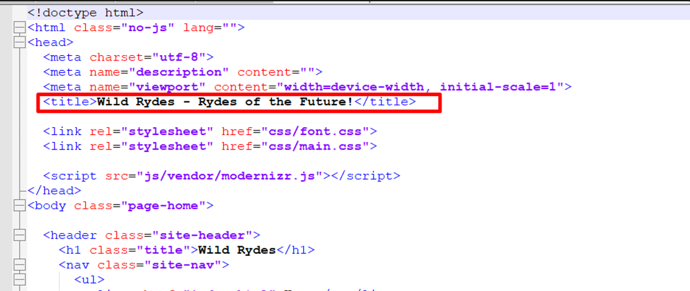


Save the file.

In terminal window, add, commit change, and push the change to the git repository again. Amplify Console will begin to build the site again soon after it notices the update to the repository. It will happen pretty quickly! Head back to the AWS Amplify console to watch the process.


```
C:\Users\HP\wildrydes-site>git add index.html

C:\Users\HP\wildrydes-site>git commit -m "updated title"
[master 31dc547] updated title
 1 file changed, 1 insertion(+), 1 deletion(-)

C:\Users\HP\wildrydes-site>git push
Enumerating objects: 5, done.
Counting objects: 100% (5/5), done.
Delta compression using up to 8 threads
Compressing objects: 100% (3/3), done.
Writing objects: 100% (3/3), 313 bytes | 78.00 KiB/s, done.
Total 3 (delta 2), reused 0 (delta 0), pack-reused 0
remote: Validating objects: 100%
To https://git-codecommit.us-east-1.amazonaws.com/v1/repos/wildrydes-site
   3c2c445..31dc547  master -> master

C:\Users\HP\wildrydes-site>
```

Once Amplify has completed the re-deployment, re-open the Wild Rydes site and notice the tab title change.


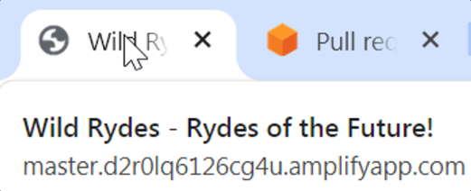


**Recap Note for Part 1**

In this part 1, created static website which will be the base for our Wild Rydes business. AWS Amplify Console can deploy static websites following a continuous integration and delivery model. It has the capability to build more complicated Javascript framework-based applications, and has features such as feature branch deployments, easy custom domain setup, instant deployments, and password protection.


## **Part 2: Manage Users**

Create an Amazon Cognito user pool and integrate an app with user pool.

Amazon Cognito provides two different mechanisms for authenticating users. Use Cognito User Pools to add sign-up and sign-in functionality to application or use Cognito Identity Pools to authenticate users through social identity providers such as Facebook, Twitter, or Amazon, with SAML identity solutions, or by using own identity system. For this module wll use a user pool as the backend for the provided registration and sign-in pages.

In the Amazon Cognito console, choose Create user pool.


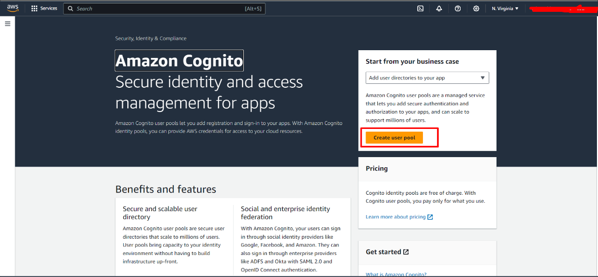


On the Configure sign-in experience page, in the Cognito user pool sign-in options section, select User name. Keep the defaults for the other settings, such as Provider types and do not make any User name requirements selections. Choose Next.


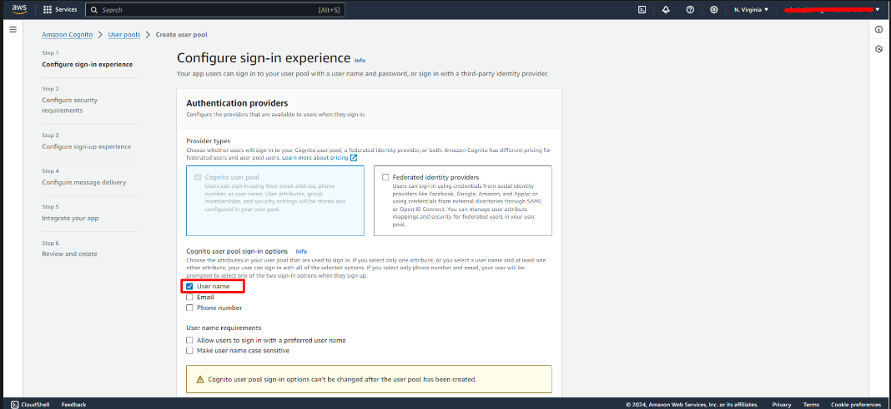


On the Configure security requirements page, keep the Password policy mode as Cognito defaults. Choose to configure multi-factor authentication (MFA) or choose No MFA and keep other configurations as default. Choose Next.


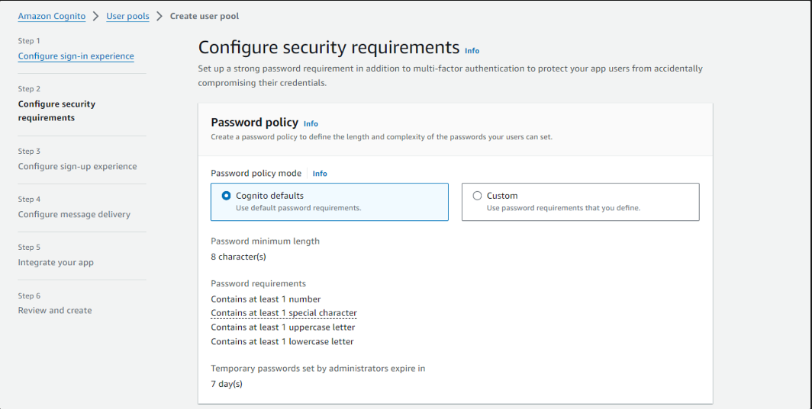


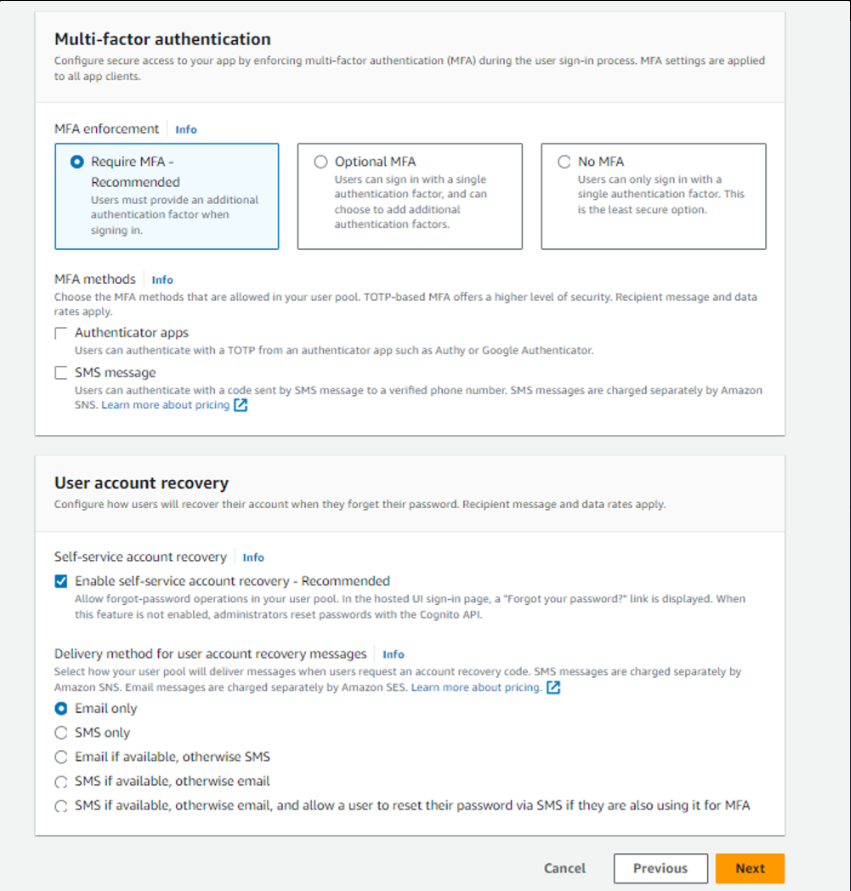


On the Configure sign-up experience page, keep everything as default. Choose Next.


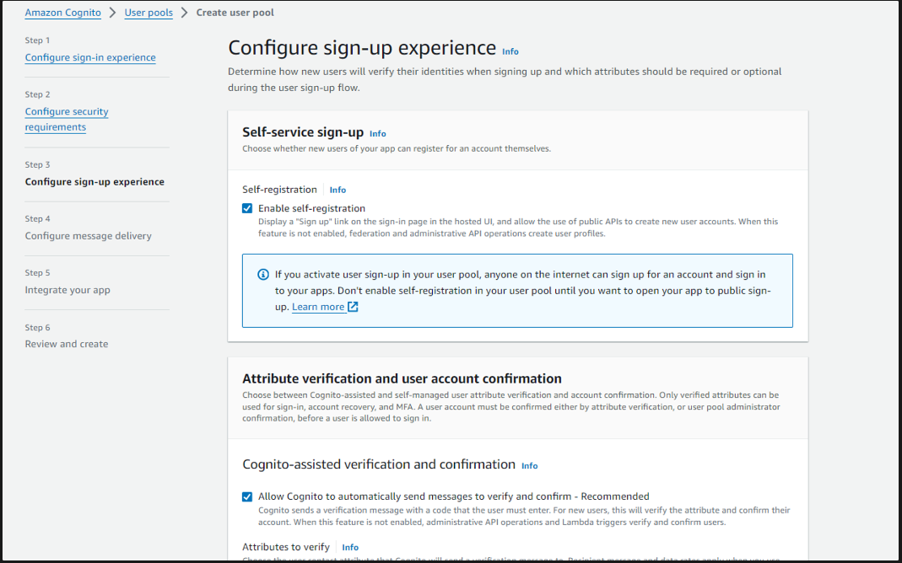


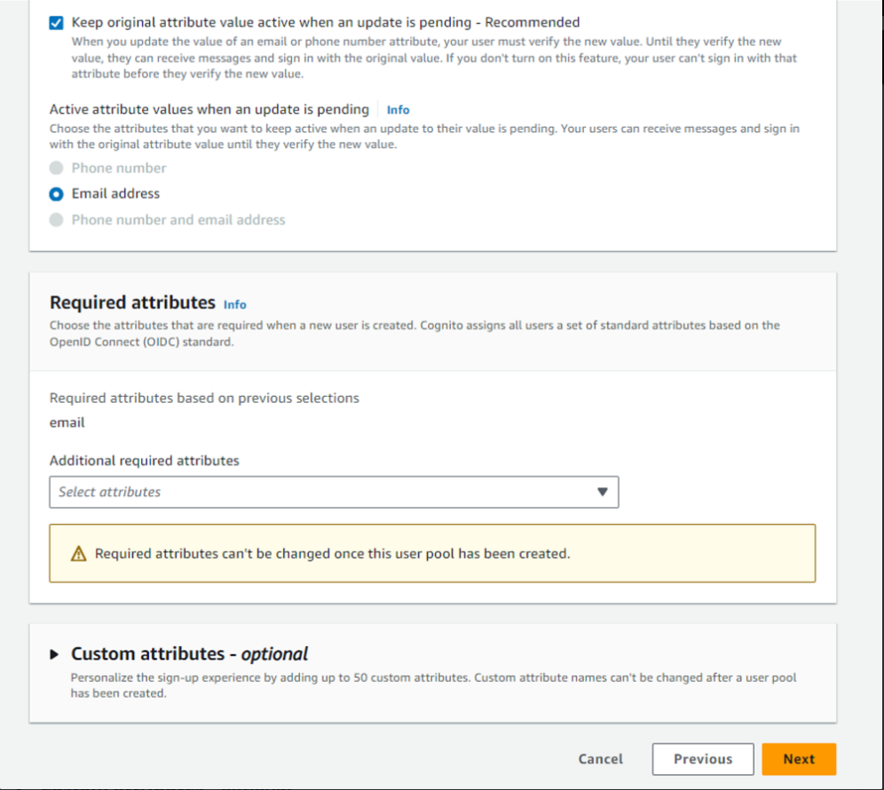


On the Configure message delivery page, for Email provider, confirm that Send email with Amazon SES - Recommended is selected. In the FROM email address field, select an email address that verified with Amazon SES, following the instructions in Verifying an email address identity in the Amazon Simple Email Service Developer Guide.
Note: If don't see the verified email address populating in the dropdown, ensure that created a verified email address in the same Region selected at the beginning of the tutorial.


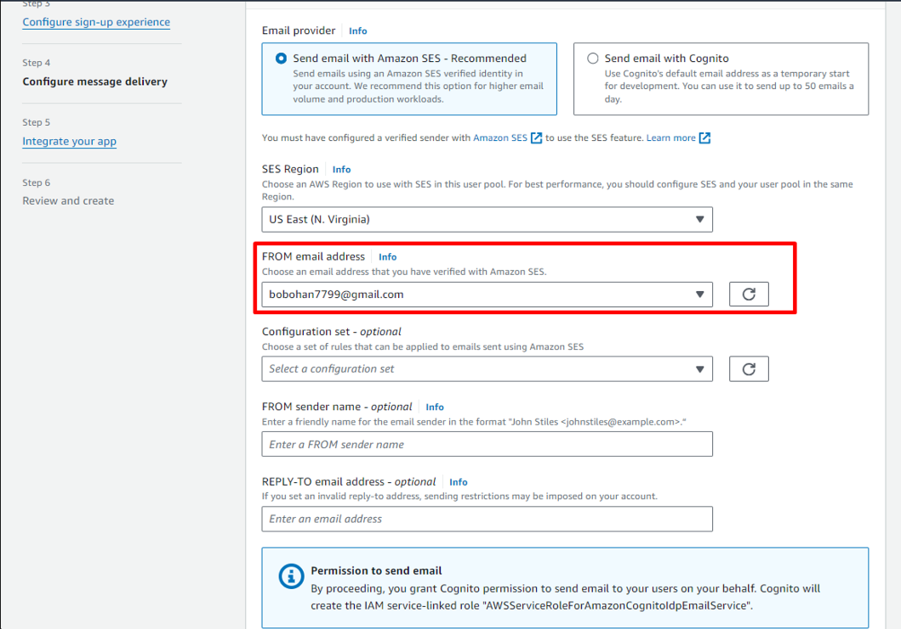


