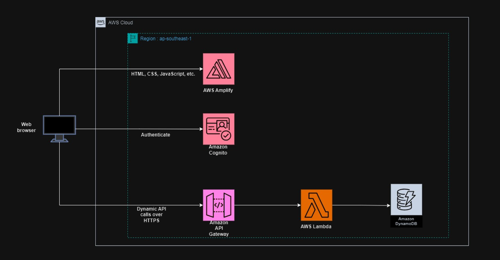
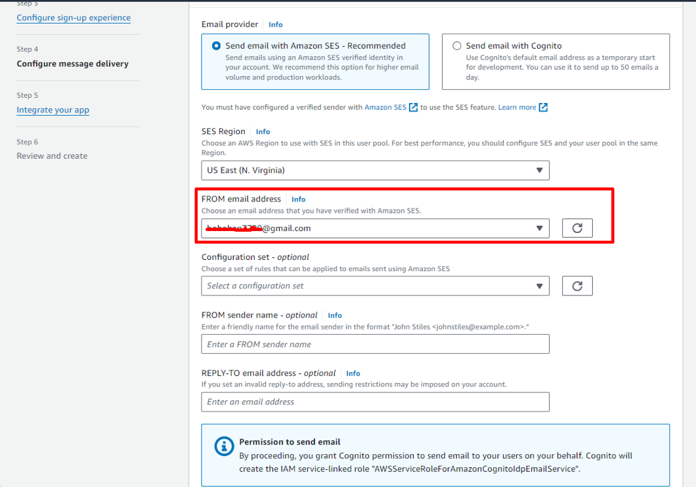
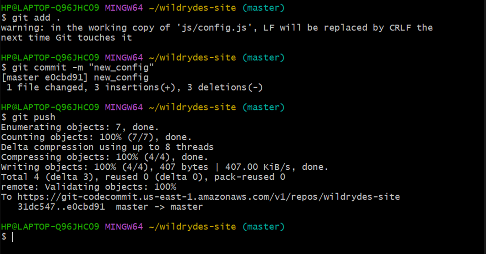

# Build a Serverless Web Application
with AWS Lambda, Amazon API Gateway, AWS Amplify, Amazon DynamoDB, and Amazon Cognito


## **Overview**

Create a simple serverless web application that enables users to request unicorn rides from the [Wild Rydes](http://www.wildrydes.com/) fleet. The application will present users with an HTML-based user interface for indicating the location where they would like to be picked up and will interact with a RESTful web service on the backend to submit the request and dispatch a nearby unicorn. The application will also provide facilities for users to register with the service and log in before requesting rides.


## Prerequisites

- AWS CLI
- ArcGIS
- Notepad++
- Chrome
- AWS Lambda
- Amazon API Gateway
- AWS Amplify
- Amazon DynamoDB
- Amazon Cognito

## **Application architecture**

The application use AWS Amplify, Amazon Cognito, AWS Lambda, Amazon DynamoDB, Amazon API Gateway. 

Amplify Console provides continuous deployment and hosting of the static web resources including HTML, CSS, JavaScript, and image files which are loaded in the user's browser. 

JavaScript executed in the browser sends and receives data from a public backend API built using Lambda and API Gateway. 

Amazon Cognito provides user management and authentication functions to secure the backend API. Finally, DynamoDB provides a persistence layer where data can be stored by the API's Lambda function.



**Step 1: Static Web Hosting**

AWS Amplify hosts static web resources including HTML, CSS, JavaScript, and image files which are loaded in the user's browser.


**Step 2: User Management**

Amazon Cognito provides user management and authentication functions to secure the backend API.


**Step 3: Serverless Backend**

Amazon DynamoDB provides a persistence layer where data can be stored by the API's Lambda function.


**Step 4: RESTful API**

JavaScript executed in the browser sends and receives data from a public backend API built using Lambda and API Gateway.


(After this lab practice, Terminate all the resources you created throughout this lab.)


## **Part 1: Static Web Hosting with Continuous Deployment**

In static web content including HTML, CSS, JavaScript, images, and other files that will be managed by AWS Amplify console. End users will access to site using public website URL which exposed by AWS Amplify console. It’s no need to run any web servers or use other services to make site available.


## **Implementation**

**Select a region**

Choose **US East (N. Virginia)** region.


**Create Git repository**

Install AWS CLI

AWS CLI install by following reference.

https://docs.aws.amazon.com/cli/latest/userguide/getting-started-install.html


Open AWS CodeCommit console


Create repository


Enter **wildrydes-site** for the **Repository name**.

Choose create


Once repository is created, set up an IAM user with Git credentials in the IAM console.


Important note

Create Access keys in the IAM > Security Credentials tab. Download the Access Key and Secret Access Key IDs or copy and save them in a secure location.

Generate HTTPS Git credentials for AWS CodeCommit. Download or save these generated credentials as well.


In the terminal window used to install AWS CLI, enter the command: aws configure

Enter the **AWS Access Key ID** and **Secret Access Key** previously created.

For **Default region name** enter the Region you initially selected to create your CodeCommit repository in.

Leave **Default output format** blank, and press enter.

The code block show in windows terminal.


Set up the git config credential helper in the terminal window.

For Windows


```bash
git config --global credential.helper "!aws codecommit credential-helper $@"
git config --global credential.UseHttpPath true
```

Result show as following in .gitconfig file;


```
[credential]
	helper = !aws codecommit credential-helper $@
	UseHttpPath = true
```


Navigate back to the AWS CodeCommit console and select the wildrydes-site repository.

Select **Clone HTTPS** from the **Clone URL** dropdown to copy the HTTPS URL.


From your terminal window run git clone and paste the HTTPS URL of the repository.


```bash
git clone https://git-codecommit.us-east-1.amazonaws.com/v1/repos/wildrydes-site
```


The following code block is an example of what you will see in your terminal window:


There will be a warning that you appear to have cloned an empty repository, this is expected.

**Populate the git repository**

Change directory into your repository and copy the static files from S3 using the following commands


```bash
cd wildrydes-site

aws s3 cp s3://wildrydes-us-east-1/WebApplication/1_StaticWebHosting/website ./ --recursive
```


If S3 not working properly, please use attached lab repository file.


```
C:\Users\HP>cd wildrydes-site

C:\Users\HP\wildrydes-site>aws s3 cp s3://wildrydes-us-east-1/WebApplication/1_StaticWebHosting/website ./ --recursive
download: s3://wildrydes-us-east-1/WebApplication/1_StaticWebHosting/website/css/message.css to css\message.css
download: s3://wildrydes-us-east-1/WebApplication/1_StaticWebHosting/website/css/font.css to css\font.css
download: s3://wildrydes-us-east-1/WebApplication/1_StaticWebHosting/website/apply.html to .\apply.html
download: s3://wildrydes-us-east-1/WebApplication/1_StaticWebHosting/website/css/ride.css to css\ride.css
download: s3://wildrydes-us-east-1/WebApplication/1_StaticWebHosting/website/favicon.ico to .\favicon.ico
download: s3://wildrydes-us-east-1/WebApplication/1_StaticWebHosting/website/fonts/glyphicons-halflings-regular.eot to fonts\glyphicons-halflings-regular.eot
download: s3://wildrydes-us-east-1/WebApplication/1_StaticWebHosting/website/css/index.css to css\index.css
download: s3://wildrydes-us-east-1/WebApplication/1_StaticWebHosting/website/css/mapbox-gl.css to css\mapbox-gl.css
download: s3://wildrydes-us-east-1/WebApplication/1_StaticWebHosting/website/fonts/fairplex-wide-n4.woff to fonts\fairplex-wide-n4.woff
download: s3://wildrydes-us-east-1/WebApplication/1_StaticWebHosting/website/faq.html to .\faq.html
download: s3://wildrydes-us-east-1/WebApplication/1_StaticWebHosting/website/css/main.css to css\main.css
download: s3://wildrydes-us-east-1/WebApplication/1_StaticWebHosting/website/fonts/fairplex-wide-n7.woff to fonts\fairplex-wide-n7.woff
download: s3://wildrydes-us-east-1/WebApplication/1_StaticWebHosting/website/fonts/glyphicons-halflings-regular.woff2 to fonts\glyphicons-halflings-regular.woff2
download: s3://wildrydes-us-east-1/WebApplication/1_StaticWebHosting/website/images/logo.png to images\logo.png
download: s3://wildrydes-us-east-1/WebApplication/1_StaticWebHosting/website/css/normalize.css to css\normalize.css
download: s3://wildrydes-us-east-1/WebApplication/1_StaticWebHosting/website/images/bbd3207c.png to images\bbd3207c.png
download: s3://wildrydes-us-east-1/WebApplication/1_StaticWebHosting/website/images/loading.gif to images\loading.gif
download: s3://wildrydes-us-east-1/WebApplication/1_StaticWebHosting/website/fonts/glyphicons-halflings-regular.woff to fonts\glyphicons-halflings-regular.woff
download: s3://wildrydes-us-east-1/WebApplication/1_StaticWebHosting/website/images/star-pattern.png to images\star-pattern.png
download: s3://wildrydes-us-east-1/WebApplication/1_StaticWebHosting/website/css/bootstrap.min.css to css\bootstrap.min.css
download: s3://wildrydes-us-east-1/WebApplication/1_StaticWebHosting/website/images/unicorn-icon.png to images\unicorn-icon.png
download: s3://wildrydes-us-east-1/WebApplication/1_StaticWebHosting/website/images/background.png to images\background.png
download: s3://wildrydes-us-east-1/WebApplication/1_StaticWebHosting/website/fonts/glyphicons-halflings-regular.svg to fonts\glyphicons-halflings-regular.svg
download: s3://wildrydes-us-east-1/WebApplication/1_StaticWebHosting/website/images/spinning-gears.gif to images\spinning-gears.gif
download: s3://wildrydes-us-east-1/WebApplication/1_StaticWebHosting/website/images/unicorn-map-bg.png to images\unicorn-map-bg.png
download: s3://wildrydes-us-east-1/WebApplication/1_StaticWebHosting/website/images/unicorn-logo.png to images\unicorn-logo.png
download: s3://wildrydes-us-east-1/WebApplication/1_StaticWebHosting/website/images/wr-home-W.png to images\wr-home-W.png
download: s3://wildrydes-us-east-1/WebApplication/1_StaticWebHosting/website/fonts/glyphicons-halflings-regular.ttf to fonts\glyphicons-halflings-regular.ttf
download: s3://wildrydes-us-east-1/WebApplication/1_StaticWebHosting/website/images/wr-home-apple.png to images\wr-home-apple.png
download: s3://wildrydes-us-east-1/WebApplication/1_StaticWebHosting/website/images/wr-home-block-2.png to images\wr-home-block-2.png
download: s3://wildrydes-us-east-1/WebApplication/1_StaticWebHosting/website/images/wr-home-block-1.png to images\wr-home-block-1.png
download: s3://wildrydes-us-east-1/WebApplication/1_StaticWebHosting/website/images/wr-home-blackberry.png to images\wr-home-blackberry.png
download: s3://wildrydes-us-east-1/WebApplication/1_StaticWebHosting/website/images/wr-home-block-3.png to images\wr-home-block-3.png
download: s3://wildrydes-us-east-1/WebApplication/1_StaticWebHosting/website/images/wr-home-instagram.png to images\wr-home-instagram.png
download: s3://wildrydes-us-east-1/WebApplication/1_StaticWebHosting/website/images/wr-home-facebook.png to images\wr-home-facebook.png
download: s3://wildrydes-us-east-1/WebApplication/1_StaticWebHosting/website/images/wr-home-google.png to images\wr-home-google.png
download: s3://wildrydes-us-east-1/WebApplication/1_StaticWebHosting/website/images/wr-home-block-4.png to images\wr-home-block-4.png
download: s3://wildrydes-us-east-1/WebApplication/1_StaticWebHosting/website/images/wr-home-Xiaomi.png to images\wr-home-Xiaomi.png
download: s3://wildrydes-us-east-1/WebApplication/1_StaticWebHosting/website/images/wr-home-about.jpg to images\wr-home-about.jpg
download: s3://wildrydes-us-east-1/WebApplication/1_StaticWebHosting/website/images/wr-faq-header.jpg to images\wr-faq-header.jpg
download: s3://wildrydes-us-east-1/WebApplication/1_StaticWebHosting/website/images/wr-home-kraken.png to images\wr-home-kraken.png
download: s3://wildrydes-us-east-1/WebApplication/1_StaticWebHosting/website/images/wr-home-twitter.png to images\wr-home-twitter.png
download: s3://wildrydes-us-east-1/WebApplication/1_StaticWebHosting/website/images/wr-home-wechat.png to images\wr-home-wechat.png
download: s3://wildrydes-us-east-1/WebApplication/1_StaticWebHosting/website/images/shadowfox.png to images\shadowfox.png
download: s3://wildrydes-us-east-1/WebApplication/1_StaticWebHosting/website/images/wr-home-top.jpg to images\wr-home-top.jpg
download: s3://wildrydes-us-east-1/WebApplication/1_StaticWebHosting/website/images/wr-home-weibo.png to images\wr-home-weibo.png
download: s3://wildrydes-us-east-1/WebApplication/1_StaticWebHosting/website/images/wr-investors-1.png to images\wr-investors-1.png
download: s3://wildrydes-us-east-1/WebApplication/1_StaticWebHosting/website/images/wr-investors-3.png to images\wr-investors-3.png
download: s3://wildrydes-us-east-1/WebApplication/1_StaticWebHosting/website/css/bootstrap.min.css.map to css\bootstrap.min.css.map
download: s3://wildrydes-us-east-1/WebApplication/1_StaticWebHosting/website/images/wr-investors-awesome.png to images\wr-investors-awesome.png
download: s3://wildrydes-us-east-1/WebApplication/1_StaticWebHosting/website/images/wr-investors-5.png to images\wr-investors-5.png
download: s3://wildrydes-us-east-1/WebApplication/1_StaticWebHosting/website/images/wr-investors-2.png to images\wr-investors-2.png
download: s3://wildrydes-us-east-1/WebApplication/1_StaticWebHosting/website/images/wr-investors-4.png to images\wr-investors-4.png
download: s3://wildrydes-us-east-1/WebApplication/1_StaticWebHosting/website/images/wr-investors-pcp.png to images\wr-investors-pcp.png
download: s3://wildrydes-us-east-1/WebApplication/1_StaticWebHosting/website/images/wr-investors-thebarn.png to images\wr-investors-thebarn.png
download: s3://wildrydes-us-east-1/WebApplication/1_StaticWebHosting/website/images/wr-logo-white.png to images\wr-logo-white.png
download: s3://wildrydes-us-east-1/WebApplication/1_StaticWebHosting/website/images/wr-logo-black.png to images\wr-logo-black.png
download: s3://wildrydes-us-east-1/WebApplication/1_StaticWebHosting/website/images/rocinante.png to images\rocinante.png
download: s3://wildrydes-us-east-1/WebApplication/1_StaticWebHosting/website/images/wr-unicorn-one.png to images\wr-unicorn-one.png
download: s3://wildrydes-us-east-1/WebApplication/1_StaticWebHosting/website/index.html to .\index.html
download: s3://wildrydes-us-east-1/WebApplication/1_StaticWebHosting/website/investors.html to .\investors.html
download: s3://wildrydes-us-east-1/WebApplication/1_StaticWebHosting/website/js/cognito-auth.js to js\cognito-auth.js
download: s3://wildrydes-us-east-1/WebApplication/1_StaticWebHosting/website/js/esri-map.js to js\esri-map.js
download: s3://wildrydes-us-east-1/WebApplication/1_StaticWebHosting/website/js/config.js to js\config.js
download: s3://wildrydes-us-east-1/WebApplication/1_StaticWebHosting/website/js/ride.js to js\ride.js
download: s3://wildrydes-us-east-1/WebApplication/1_StaticWebHosting/website/js/main.js to js\main.js
download: s3://wildrydes-us-east-1/WebApplication/1_StaticWebHosting/website/js/vendor.js to js\vendor.js
download: s3://wildrydes-us-east-1/WebApplication/1_StaticWebHosting/website/images/unicorn-silhouette.png to images\unicorn-silhouette.png
download: s3://wildrydes-us-east-1/WebApplication/1_StaticWebHosting/website/images/wr-unicorn-header.png to images\wr-unicorn-header.png
download: s3://wildrydes-us-east-1/WebApplication/1_StaticWebHosting/website/js/vendor/amazon-cognito-identity.min.js to js\vendor\amazon-cognito-identity.min.js
download: s3://wildrydes-us-east-1/WebApplication/1_StaticWebHosting/website/js/vendor/bootstrap.min.js to js\vendor\bootstrap.min.js
download: s3://wildrydes-us-east-1/WebApplication/1_StaticWebHosting/website/js/vendor/html5shiv.min.js to js\vendor\html5shiv.min.js
download: s3://wildrydes-us-east-1/WebApplication/1_StaticWebHosting/website/js/vendor/moment.min.js to js\vendor\moment.min.js
download: s3://wildrydes-us-east-1/WebApplication/1_StaticWebHosting/website/js/vendor/aws-cognito-sdk.min.js to js\vendor\aws-cognito-sdk.min.js
download: s3://wildrydes-us-east-1/WebApplication/1_StaticWebHosting/website/js/vendor/modernizr.js to js\vendor\modernizr.js
download: s3://wildrydes-us-east-1/WebApplication/1_StaticWebHosting/website/js/vendor/respond.min.js to js\vendor\respond.min.js
download: s3://wildrydes-us-east-1/WebApplication/1_StaticWebHosting/website/ride.html to .\ride.html
download: s3://wildrydes-us-east-1/WebApplication/1_StaticWebHosting/website/images/wr-investors-header.png to images\wr-investors-header.png
download: s3://wildrydes-us-east-1/WebApplication/1_StaticWebHosting/website/robots.txt to .\robots.txt
download: s3://wildrydes-us-east-1/WebApplication/1_StaticWebHosting/website/images/bucephalus.png to images\bucephalus.png
download: s3://wildrydes-us-east-1/WebApplication/1_StaticWebHosting/website/signin.html to .\signin.html
download: s3://wildrydes-us-east-1/WebApplication/1_StaticWebHosting/website/register.html to .\register.html
download: s3://wildrydes-us-east-1/WebApplication/1_StaticWebHosting/website/verify.html to .\verify.html
download: s3://wildrydes-us-east-1/WebApplication/1_StaticWebHosting/website/unicorns.html to .\unicorns.html
download: s3://wildrydes-us-east-1/WebApplication/1_StaticWebHosting/website/js/vendor/unicorn-icon to js\vendor\unicorn-icon
download: s3://wildrydes-us-east-1/WebApplication/1_StaticWebHosting/website/images/wr-unicorn-two.png to images\wr-unicorn-two.png
download: s3://wildrydes-us-east-1/WebApplication/1_StaticWebHosting/website/images/wr-unicorn-three.png to images\wr-unicorn-three.png
download: s3://wildrydes-us-east-1/WebApplication/1_StaticWebHosting/website/images/wr-apply-header.png to images\wr-apply-header.png
download: s3://wildrydes-us-east-1/WebApplication/1_StaticWebHosting/website/js/vendor/jquery-3.1.0.js to js\vendor\jquery-3.1.0.js
download: s3://wildrydes-us-east-1/WebApplication/1_StaticWebHosting/website/images/wr-home-quote.jpg to images\wr-home-quote.jpg
download: s3://wildrydes-us-east-1/WebApplication/1_StaticWebHosting/website/images/wr-home-quote.png to images\wr-home-quote.png

C:\Users\HP\wildrydes-site>
```


Add, commit, and push the git files.


```bash
git add .
git commit -m "new files"
git push
```


Show result as below;

```
C:\Users\HP\wildrydes-site>git add
Nothing specified, nothing added.
hint: Maybe you wanted to say 'git add .'?
hint: Turn this message off by running
hint: "git config advice.addEmptyPathspec false"

C:\Users\HP\wildrydes-site>git add .
warning: in the working copy of 'apply.html', LF will be replaced by CRLF the next time Git touches it
warning: in the working copy of 'css/bootstrap.min.css', LF will be replaced by CRLF the next time Git touches it
warning: in the working copy of 'css/font.css', LF will be replaced by CRLF the next time Git touches it
warning: in the working copy of 'css/index.css', LF will be replaced by CRLF the next time Git touches it
warning: in the working copy of 'css/main.css', LF will be replaced by CRLF the next time Git touches it
warning: in the working copy of 'css/mapbox-gl.css', LF will be replaced by CRLF the next time Git touches it
warning: in the working copy of 'css/message.css', LF will be replaced by CRLF the next time Git touches it
warning: in the working copy of 'css/normalize.css', LF will be replaced by CRLF the next time Git touches it
warning: in the working copy of 'css/ride.css', LF will be replaced by CRLF the next time Git touches it
warning: in the working copy of 'faq.html', LF will be replaced by CRLF the next time Git touches it
warning: in the working copy of 'fonts/glyphicons-halflings-regular.svg', LF will be replaced by CRLF the next time Git touches it
warning: in the working copy of 'index.html', LF will be replaced by CRLF the next time Git touches it
warning: in the working copy of 'investors.html', LF will be replaced by CRLF the next time Git touches it
warning: in the working copy of 'js/cognito-auth.js', LF will be replaced by CRLF the next time Git touches it
warning: in the working copy of 'js/config.js', LF will be replaced by CRLF the next time Git touches it
warning: in the working copy of 'js/esri-map.js', LF will be replaced by CRLF the next time Git touches it
warning: in the working copy of 'js/ride.js', LF will be replaced by CRLF the next time Git touches it
warning: in the working copy of 'js/vendor.js', LF will be replaced by CRLF the next time Git touches it
warning: in the working copy of 'js/vendor/amazon-cognito-identity.min.js', LF will be replaced by CRLF the next time Git touches it
warning: in the working copy of 'js/vendor/aws-cognito-sdk.min.js', LF will be replaced by CRLF the next time Git touches it
warning: in the working copy of 'js/vendor/bootstrap.min.js', LF will be replaced by CRLF the next time Git touches it
warning: in the working copy of 'js/vendor/html5shiv.min.js', LF will be replaced by CRLF the next time Git touches it
warning: in the working copy of 'js/vendor/jquery-3.1.0.js', LF will be replaced by CRLF the next time Git touches it
warning: in the working copy of 'js/vendor/moment.min.js', LF will be replaced by CRLF the next time Git touches it
warning: in the working copy of 'js/vendor/respond.min.js', LF will be replaced by CRLF the next time Git touches it
warning: in the working copy of 'register.html', LF will be replaced by CRLF the next time Git touches it
warning: in the working copy of 'ride.html', LF will be replaced by CRLF the next time Git touches it
warning: in the working copy of 'robots.txt', LF will be replaced by CRLF the next time Git touches it
warning: in the working copy of 'signin.html', LF will be replaced by CRLF the next time Git touches it
warning: in the working copy of 'unicorns.html', LF will be replaced by CRLF the next time Git touches it
warning: in the working copy of 'verify.html', LF will be replaced by CRLF the next time Git touches it

C:\Users\HP\wildrydes-site>git commit -m "new files"
[master (root-commit) 3c2c445] new files
 91 files changed, 13680 insertions(+)
 create mode 100644 apply.html
 create mode 100644 css/bootstrap.min.css
 create mode 100644 css/bootstrap.min.css.map
 create mode 100644 css/font.css
 create mode 100644 css/index.css
 create mode 100644 css/main.css
 create mode 100644 css/mapbox-gl.css
 create mode 100644 css/message.css
 create mode 100644 css/normalize.css
 create mode 100644 css/ride.css
 create mode 100644 faq.html
 create mode 100644 favicon.ico
 create mode 100644 fonts/fairplex-wide-n4.woff
 create mode 100644 fonts/fairplex-wide-n7.woff
 create mode 100644 fonts/glyphicons-halflings-regular.eot
 create mode 100644 fonts/glyphicons-halflings-regular.svg
 create mode 100644 fonts/glyphicons-halflings-regular.ttf
 create mode 100644 fonts/glyphicons-halflings-regular.woff
 create mode 100644 fonts/glyphicons-halflings-regular.woff2
 create mode 100644 images/background.png
 create mode 100644 images/bbd3207c.png
 create mode 100644 images/bucephalus.png
 create mode 100644 images/loading.gif
 create mode 100644 images/logo.png
 create mode 100644 images/rocinante.png
 create mode 100644 images/shadowfox.png
 create mode 100644 images/spinning-gears.gif
 create mode 100644 images/star-pattern.png
 create mode 100644 images/unicorn-icon.png
 create mode 100644 images/unicorn-logo.png
 create mode 100644 images/unicorn-map-bg.png
 create mode 100644 images/unicorn-silhouette.png
 create mode 100644 images/wr-apply-header.png
 create mode 100644 images/wr-faq-header.jpg
 create mode 100644 images/wr-home-W.png
 create mode 100644 images/wr-home-Xiaomi.png
 create mode 100644 images/wr-home-about.jpg
 create mode 100644 images/wr-home-apple.png
 create mode 100644 images/wr-home-blackberry.png
 create mode 100644 images/wr-home-block-1.png
 create mode 100644 images/wr-home-block-2.png
 create mode 100644 images/wr-home-block-3.png
 create mode 100644 images/wr-home-block-4.png
 create mode 100644 images/wr-home-facebook.png
 create mode 100644 images/wr-home-google.png
 create mode 100644 images/wr-home-instagram.png
 create mode 100644 images/wr-home-kraken.png
 create mode 100644 images/wr-home-quote.jpg
 create mode 100644 images/wr-home-quote.png
 create mode 100644 images/wr-home-top.jpg
 create mode 100644 images/wr-home-twitter.png
 create mode 100644 images/wr-home-wechat.png
 create mode 100644 images/wr-home-weibo.png
 create mode 100644 images/wr-investors-1.png
 create mode 100644 images/wr-investors-2.png
 create mode 100644 images/wr-investors-3.png
 create mode 100644 images/wr-investors-4.png
 create mode 100644 images/wr-investors-5.png
 create mode 100644 images/wr-investors-awesome.png
 create mode 100644 images/wr-investors-header.png
 create mode 100644 images/wr-investors-pcp.png
 create mode 100644 images/wr-investors-thebarn.png
 create mode 100644 images/wr-logo-black.png
 create mode 100644 images/wr-logo-white.png
 create mode 100644 images/wr-unicorn-header.png
 create mode 100644 images/wr-unicorn-one.png
 create mode 100644 images/wr-unicorn-three.png
 create mode 100644 images/wr-unicorn-two.png
 create mode 100644 index.html
 create mode 100644 investors.html
 create mode 100644 js/cognito-auth.js
 create mode 100644 js/config.js
 create mode 100644 js/esri-map.js
 create mode 100644 js/main.js
 create mode 100644 js/ride.js
 create mode 100644 js/vendor.js
 create mode 100644 js/vendor/amazon-cognito-identity.min.js
 create mode 100644 js/vendor/aws-cognito-sdk.min.js
 create mode 100644 js/vendor/bootstrap.min.js
 create mode 100644 js/vendor/html5shiv.min.js
 create mode 100644 js/vendor/jquery-3.1.0.js
 create mode 100644 js/vendor/modernizr.js
 create mode 100644 js/vendor/moment.min.js
 create mode 100644 js/vendor/respond.min.js
 create mode 100644 js/vendor/unicorn-icon
 create mode 100644 register.html
 create mode 100644 ride.html
 create mode 100644 robots.txt
 create mode 100644 signin.html
 create mode 100644 unicorns.html
 create mode 100644 verify.html

C:\Users\HP\wildrydes-site>git push
Enumerating objects: 95, done.
Counting objects: 100% (95/95), done.
Delta compression using up to 8 threads
Compressing objects: 100% (94/94), done.
Writing objects: 100% (95/95), 9.44 MiB | 428.00 KiB/s, done.
Total 95 (delta 2), reused 0 (delta 0), pack-reused 0
remote: Validating objects: 100%
To https://git-codecommit.us-east-1.amazonaws.com/v1/repos/wildrydes-site
 * [new branch]      master -> master

C:\Users\HP\wildrydes-site>
```


If code commit error occur

https://docs.aws.amazon.com/codecommit/latest/userguide/setting-up-gc.html#setting-up-gc-account

**Enable web hosting with the AWS Amplify Console**


Launch the AWS Amplify console.

Choose Get Started.


Under the Amplify Hosting Host your web app header, choose Get Started.


On the Get started with Amplify Hosting page, select AWS CodeCommit and choose Continue.


On the Add repository branch step, select wildrydes-site from the Select a repository dropdown.


If you used GitHub, you'll need to authorize AWS Amplify to your GitHub account.

In the Branch dropdown select master and choose Next.


On the Build settings page, leave all the defaults, select Allow AWS Amplify to automatically deploy all files hosted in your project root directory and choose Next.


On the Review page select Save and deploy.


The process takes a couple of minutes for Amplify Console to create the necessary resources and to deploy code.

Once completed, select the site image, or the link underneath the thumbnail to launch Wild Rydes site. If select the link for **master** will see the build and deployment details related to branch.


**Modify site**

The AWS Amplify console will rebuild and redeploy the app when it detects changes to the connected repository. Make a change to the main page to test out this process.

On local machine, navigate to the the wildrydes-site folder and open the index.html file in a text editor of choice.


Modify the title line with the following text: <title>Wild Rydes - Rydes of the Future!</title>


Save the file.

In terminal window, add, commit change, and push the change to the git repository again. Amplify Console will begin to build the site again soon after it notices the update to the repository. It will happen pretty quickly! Head back to the AWS Amplify console to watch the process.


```
C:\Users\HP\wildrydes-site>git add index.html

C:\Users\HP\wildrydes-site>git commit -m "updated title"
[master 31dc547] updated title
 1 file changed, 1 insertion(+), 1 deletion(-)

C:\Users\HP\wildrydes-site>git push
Enumerating objects: 5, done.
Counting objects: 100% (5/5), done.
Delta compression using up to 8 threads
Compressing objects: 100% (3/3), done.
Writing objects: 100% (3/3), 313 bytes | 78.00 KiB/s, done.
Total 3 (delta 2), reused 0 (delta 0), pack-reused 0
remote: Validating objects: 100%
To https://git-codecommit.us-east-1.amazonaws.com/v1/repos/wildrydes-site
   3c2c445..31dc547  master -> master

C:\Users\HP\wildrydes-site>
```

Once Amplify has completed the re-deployment, re-open the Wild Rydes site and notice the tab title change.


**Recap Note for Part 1**

In this part 1, created static website which will be the base for our Wild Rydes business. AWS Amplify Console can deploy static websites following a continuous integration and delivery model. It has the capability to build more complicated Javascript framework-based applications, and has features such as feature branch deployments, easy custom domain setup, instant deployments, and password protection.


## **Part 2: Manage Users**

Create an Amazon Cognito user pool and integrate an app with user pool.

Amazon Cognito provides two different mechanisms for authenticating users. Use Cognito User Pools to add sign-up and sign-in functionality to application or use Cognito Identity Pools to authenticate users through social identity providers such as Facebook, Twitter, or Amazon, with SAML identity solutions, or by using own identity system. For this module wll use a user pool as the backend for the provided registration and sign-in pages.

In the Amazon Cognito console, choose Create user pool.


On the Configure sign-in experience page, in the Cognito user pool sign-in options section, select User name. Keep the defaults for the other settings, such as Provider types and do not make any User name requirements selections. Choose Next.


On the Configure security requirements page, keep the Password policy mode as Cognito defaults. Choose to configure multi-factor authentication (MFA) or choose No MFA and keep other configurations as default. Choose Next.


On the Configure sign-up experience page, keep everything as default. Choose Next.


On the Configure message delivery page, for Email provider, confirm that Send email with Amazon SES - Recommended is selected. In the FROM email address field, select an email address that verified with Amazon SES, following the instructions in Verifying an email address identity in the Amazon Simple Email Service Developer Guide.
Note: If don't see the verified email address populating in the dropdown, ensure that created a verified email address in the same Region selected at the beginning of the tutorial.





**Note: AWS SES identities not configure using this URL to create identities.**

https://docs.aws.amazon.com/ses/latest/dg/creating-identities.html#just-verify-email-proc


On the Integrate app page, name user pool: WildRydes. Under Initial app client, name the app client: WildRydesWebApp and keep the other settings as default.


On the Review and create page, choose Create user pool.


On the User pools page, select the User pool name to view detailed information about the user pool you created. Copy the User Pool ID in the User pool overview section and save it in a secure location on local machine.


Select the App Integration tab and copy and save the Client ID in the App clients and analytics section of your newly created user pool.


Update the website config file

The **js/config.js** file contains settings for the user pool ID, app client ID and Region. Update this file with the settings from the user pool and app created in the previous steps and upload the file back to bucket.

Sample from reference


```
window._config = {
    cognito: {
        userPoolId: 'us-west-2_uXboG5pAb', // e.g. us-east-2_uXboG5pAb
        userPoolClientId: '25ddkmj4v6hfsfvruhpfi7n4hv', // e.g. 25ddkmj4v6hfsfvruhpfi7n4hv
        region: 'us-west-2' // e.g. us-east-2
    },
    api: {
        invokeUrl: '' // e.g. https://rc7nyt4tql.execute-api.us-west-2.amazonaws.com/prod',
    }
};
```

From local machine, open the **wildryde-site/js/config.js** file in a text editor of choice.


Update the cognito section of the file with the correct values for the **User pool ID** and **App Client ID** you saved in Steps 8 and 9 in the previous section. The **userPoolID** is the **User pool ID** from the **User pool overview** section, and the **userPoolClientID** is the **App Client ID** from the **App Integration** > **App clients and analytics** section of Amazon Cognito.

The value for region should be the AWS Region code where created user pool. For example, **us-east-1** for the N. Virginia Region, or **us-west-2** for the Oregon Region. If not sure which code to use, look at the Pool ARN value on the User pool overview. The Region code is the part of the ARN immediately after **arn:aws:cognito-idp:***.*

Save the modified file.

The following code block is an example of what will see in terminal window:

Modify code

```
window._config = {
    cognito: {
        userPoolId: 'us-east-1_QRFUqcg6e', // e.g. us-east-2_uXboG5pAb
        userPoolClientId: '5bgi6qcrfr2cv5mn22r5tam6rl', // e.g. 25ddkmj4v6hfsfvruhpfi7n4hv
        region: 'us-east-1' // e.g. us-east-2
    },
    api: {
        invokeUrl: '' // e.g. https://rc7nyt4tql.execute-api.us-west-2.amazonaws.com/prod',
    }
};
```


In terminal window, add, commit, and push the file to Git repository to have it automatically deploy to Amplify Console.


```
git add .
git commit -m "new_config"
git push
```





### **Validate your implementation**

In a Finder window or Windows File Explorer, navigate to the wildrydes-site folder copied to local machine in Module 1.

Open /register.html, or choose the Giddy Up! button on the homepage (index.html page) of site.


Or


Giddy Up


Complete the registration form and choose Let's Ryde. Use own email or enter a fake email. Make sure to choose a password that contains at least one upper-case letter, a number, and a special character. Don't forget the password entered for later. See an alert that confirms that user has been created.


Confirm new user using one of the two following methods:

If used an email address control, can complete the account verification process by visiting /verify.html under website domain and entering the verification code that is emailed. Please note, the verification email may end up in spam folder. For real deployments we recommend configuring user pool to use Amazon Simple Email Service to send emails from a own domain.


If used a dummy email address, must confirm the user manually through the Cognito console.
         In the Amazon Cognito console, select the WildRydes user pool.

       4.2.2 In the Users tab, see a user corresponding to the email address that submitted through the registration page. Choose that username to view the user detail page.

 In the Actions dropdown, select Confirm account to finalize the account creation process.

In the Confirm account for user pop-up, choose Confirm.

After confirming the new user using either the /verify.html page or the Cognito console, visit /signin.html and log in using the email address and password entered during the registration step.

If successful should be redirected to /ride.html. See a notification that the API is not configured.
Important: Copy and save the auth token in order to create the Amazon Cognito user pool authorizer in the next module.


# Part 3: Serverless Service Backend

## Implementation

### **Create an Amazon DynamoDB table**

Use the Amazon DynamoDB console to create a new DynamoDB table.

In the Amazon DynamoDB console, choose Create table.


For the Table name, enter Rides. This field is case sensitive.


For the Partition key, enter RideId and select String for the key type. This field is case sensitive.

In the Table settings section, ensure Default settings is selected, and choose Create table.


On the Tables page, wait for table creation to complete. Once it is completed, the status will say Active. Select table name.


In the Overview tab > General Information section of new table and choose Additional info. Copy the ARN. Use this in the next section.


### C**reate an IAM role for Lambda function**

Every Lambda function has an IAM role associated with it. This role defines what other AWS services the function is allowed to interact with. For the purposes of this tutorial, will need to create an IAM role that grants Lambda function permission to write logs to Amazon CloudWatch Logs and access to write items to DynamoDB table.

In the IAM console, select Roles in the left navigation pane and then choose Create Role.


In the Trusted Entity Type section, select AWS service. For Use case, select Lambda, then choose Next.
Note: Selecting a role type automatically creates a trust policy for role that allows AWS services to assume this role. If creating this role using the CLI, AWS CloudFormation, or another mechanism, specify a trust policy directly.


Enter AWSLambdaBasicExecutionRole in the filter text box and press Enter.

Select the checkbox next to the AWSLambdaBasicExecutionRole policy name and choose Next.


Enter WildRydesLambda for the Role Name. Keep the default settings for the other parameters.


Choose Create Role.

In the filter box on the Roles page type WildRydesLambda and select the name of the role created.


On the Permissions tab, under Add permissions, choose Create Inline Policy.


In the Select a service section, type DynamoDB into the search bar, and select DynamoDB when it appears.


Choose Select actions.

In the Actions allowed section, type PutItem into the search bar and select the checkbox next to PutItem when it appears.


In the Resources section, with the Specific option selected, choose the Add ARN link.


Select the Text tab. Paste the ARN of the table created in DynamoDB (Step 6 in the previous section), and choose Add ARNs.


Choose Next.

Enter **DynamoDBWriteAccess** for the policy name and choose Create policy.


### **Create a Lambda function for handling requests**

AWS Lambda will run code in response to events such as an HTTP request. In this step will build the core function that will process API requests from the web application to dispatch a unicorn. In the next module will use Amazon API Gateway to create a RESTful API that will expose an HTTP endpoint that can be invoked from users' browsers. Then connect the Lambda function create in this step to that API in order to create a fully functional backend for web application.

Use the AWS Lambda console to create a new Lambda function called RequestUnicorn that will process the API requests. Use the following requestUnicorn.js example implementation for function code. Just copy and paste from that file into the AWS Lambda console's editor.

Make sure to configure function to use the WildRydesLambda IAM role created in the previous section.

From the AWS Lambda console, choose Create a function.


Keep the default Author from scratch card selected.


Enter RequestUnicorn in the Function name field.


Select Node.js 16.x for the Runtime (newer versions of Node.js will not work in this tutorial).


Select Use an existing role from the Change default execution role dropdown.


Select WildRydesLambda from the Existing Role dropdown.


Click on Create function.


Scroll down to the Code source section and replace the existing code in the index.js code editor with the contents of requestUnicorn.js. The following code block displays the requestUnicorn.js file. Copy and paste this code into the index.js tab of the code editor.


```
const randomBytes = require('crypto').randomBytes;
const AWS = require('aws-sdk');
const ddb = new AWS.DynamoDB.DocumentClient();

const fleet = [
    {
        Name: 'Angel',
        Color: 'White',
        Gender: 'Female',
    },
    {
        Name: 'Gil',
        Color: 'White',
        Gender: 'Male',
    },
    {
        Name: 'Rocinante',
        Color: 'Yellow',
        Gender: 'Female',
    },
];

exports.handler = (event, context, callback) => {
    if (!event.requestContext.authorizer) {
      errorResponse('Authorization not configured', context.awsRequestId, callback);
      return;
    }

    const rideId = toUrlString(randomBytes(16));
    console.log('Received event (', rideId, '): ', event);

    // Because we're using a Cognito User Pools authorizer, all of the claims
    // included in the authentication token are provided in the request context.
    // This includes the username as well as other attributes.
    const username = event.requestContext.authorizer.claims['cognito:username'];

    // The body field of the event in a proxy integration is a raw string.
    // In order to extract meaningful values, we need to first parse this string
    // into an object. A more robust implementation might inspect the Content-Type
    // header first and use a different parsing strategy based on that value.
    const requestBody = JSON.parse(event.body);

    const pickupLocation = requestBody.PickupLocation;

    const unicorn = findUnicorn(pickupLocation);

    recordRide(rideId, username, unicorn).then(() => {
        // You can use the callback function to provide a return value from your Node.js
        // Lambda functions. The first parameter is used for failed invocations. The
        // second parameter specifies the result data of the invocation.

        // Because this Lambda function is called by an API Gateway proxy integration
        // the result object must use the following structure.
        callback(null, {
            statusCode: 201,
            body: JSON.stringify({
                RideId: rideId,
                Unicorn: unicorn,
                Eta: '30 seconds',
                Rider: username,
            }),
            headers: {
                'Access-Control-Allow-Origin': '*',
            },
        });
    }).catch((err) => {
        console.error(err);

        // If there is an error during processing, catch it and return
        // from the Lambda function successfully. Specify a 500 HTTP status
        // code and provide an error message in the body. This will provide a
        // more meaningful error response to the end client.
        errorResponse(err.message, context.awsRequestId, callback)
    });
};

// This is where you would implement logic to find the optimal unicorn for
// this ride (possibly invoking another Lambda function as a microservice.)
// For simplicity, we'll just pick a unicorn at random.
function findUnicorn(pickupLocation) {
    console.log('Finding unicorn for ', pickupLocation.Latitude, ', ', pickupLocation.Longitude);
    return fleet[Math.floor(Math.random() * fleet.length)];
}

function recordRide(rideId, username, unicorn) {
    return ddb.put({
        TableName: 'Rides',
        Item: {
            RideId: rideId,
            User: username,
            Unicorn: unicorn,
            RequestTime: new Date().toISOString(),
        },
    }).promise();
}

function toUrlString(buffer) {
    return buffer.toString('base64')
        .replace(/\+/g, '-')
        .replace(/\//g, '_')
        .replace(/=/g, '');
}

function errorResponse(errorMessage, awsRequestId, callback) {
  callback(null, {
    statusCode: 500,
    body: JSON.stringify({
      Error: errorMessage,
      Reference: awsRequestId,
    }),
    headers: {
      'Access-Control-Allow-Origin': '*',
    },
  });
}
```


Choose Deploy.


### **Validate Implementation**

For this module will test the function that you built using the AWS Lambda console. In next session will add a REST API with API Gateway so can invoke function from the browser-based application that deployed in the first module.

1. In the **RequestUnicorn** function you built in the previous section, choose **Test** in the **Code source** section, and select **Configure test event** from the dropdown.


Keep the Create new event default selection.


TestRequestEvent in the Event name field.


Copy and paste the following test event into the Event JSON section:


```
{
    "path": "/ride",
    "httpMethod": "POST",
    "headers": {
        "Accept": "*/*",
        "Authorization": "eyJraWQiOiJLTzRVMWZs",
        "content-type": "application/json; charset=UTF-8"
    },
    "queryStringParameters": null,
    "pathParameters": null,
    "requestContext": {
        "authorizer": {
            "claims": {
                "cognito:username": "the_username"
            }
        }
    },
    "body": "{\"PickupLocation\":{\"Latitude\":47.6174755835663,\"Longitude\":-122.28837066650185}}"
}
```


Choose **Save**.

In the **Code source** section of your function, choose **Test** and select **TestRequestEvent** **from the dropdown.


On the Test tab, choose Test.


In the Executing function:succeeded message that appears, expand the Details dropdown.


Verify that the function result looks like the following:


```
{
    "statusCode": 201,
    "body": "{\"RideId\":\"SvLnijIAtg6inAFUBRT+Fg==\",\"Unicorn\":{\"Name\":\"Rocinante\",\"Color\":\"Yellow\",\"Gender\":\"Female\"},\"Eta\":\"30 seconds\"}",
    "headers": {
        "Access-Control-Allow-Origin": "*"
    }
}
```


# **Part 4: Deploy a RESTful API**

## **Create a new REST API**

1. In the **Amazon API Gateway** console, select **APIs** in the left navigation pane.


Choose Build under REST API. 


In the **Choose the protocol** section, select **REST**. 

In the **Create new API** section, select **New API**.


In the **Settings** section, enter **WildRydes** **for the **API Name** and select **Edge optimized** in the **Endpoint Type** dropdown. 

**Note:** Use edge-optimized endpoint types for public services being accessed from the Internet. Regional endpoints are typically used for APIs that are accessed primarily from within the same AWS Region.


Choose **Create API.**


## Create authorizer

Create an Amazon Cognito User Pools Authorizer. Amazon API Gateway uses JSON web tokens (JWT), which are returned by the Amazon Cognito User Pool to authenticate the API calls. 
In this section, creating an Authorizer for the API, can make use of the user pool.

Use the following steps to configure the Authorizer in the Amazon API Gateway console:

In the left navigation pane of the WildRydes API created, select **Authorizers**.


Choose Create New Authorizer.


Enter WildRydes into the Authorizer Name field.


Select Cognito as the Type.


Under Cognito User Pool, in the Region drop-down, select the same Region have been using for the rest of the tutorial. Enter WildRydes in the Cognito User Pool name field.


Enter Authorization for the Token Source.


Choose Create.


To verify the authorizer configuration, select Test.


Paste the Authorization Token copied from the ride.html webpage in the Validate  implementation into the Authorization (header) field, and verify that the HTTP status Response code is 200.


In this section you will create a new resource within API. Then create a POST method for that resource and configure it to use a Lambda proxy integration backed by the RequestUnicorn function created.

In the left navigation pane of WildRydes API, select **Resources.**


From the **Actions** dropdown, select **Create Resource**.

Enter ****ride** **as the **Resource Name**, which will automatically create the **Resource Path** **/ride**.


Select the checkbox for Enable API Gateway CORS.


Choose Create Resource.


With the newly created /ride resource selected, from the Actions dropdown select Create Method.


Select POST from the new dropdown that appears under OPTIONS, then select the checkmark icon.


Select Lambda Function for the Integration type.


Select the checkbox for Use Lambda Proxy integration.


Select the same Region you have been using throughout the tutorial for Lambda Region.


Enter RequestUnicorn for Lambda Function.


Choose Save. Note: If you get an error that function does not exist, check that the region selected matches the one used in the previous modules.


When prompted to give Amazon API Gateway permission to invoke your function, choose **OK**.

Select the **Method Request** card.

Choose the pencil icon next to **Authorization**.

Select the **WildRydes** Cognito user pool authorizer from the drop-down list, and select the **checkmark** icon.


## Deploy API

Deploy  API from the Amazon API Gateway console.

In the **Actions** drop-down list select **Deploy API**.


Select [New Stage] in the Deployment stage drop-down list.


Enter prod for the Stage Name.


Choose Deploy.


Copy the Invoke URL. You will use it in the next section.


## Update the website config

In this step will update the **/js/config.js** file in website deployment to include the Invoke URL of the stage created. Copy the Invoke URL directly from the top of the stage editor page on the Amazon API Gateway console and paste it into the **invokeUrl** key of site's **config.js** file. Config file will still contain the updates made in the previous module for your Amazon Cognito **userPoolID**, **userPoolClientID**, and **region**.

On local machine, navigate to the **js** folder, and open the **config.js** file in a text editor of choice


Paste the Invoke URL copied from the Amazon API Gateway console in the previous section into the invokeUrl value of the config.js file.


Save the file.

See the following example of a completed **config.js** file. Note, the actual values in file will be different.


```
window._config = {

    cognito: {

        userPoolId: 'us-west-2_uXboG5pAb', // e.g. us-east-2_uXboG5pAb         

        userPoolClientId: '25ddkmj4v6hfsfvruhpfi7n4hv', // e.g. 25ddkmj4v6hfsfvruhpfi7n4hv

        region: 'us-west-2' // e.g. us-east-2 

    }, 

    api: { 

        invokeUrl: 'https://rc7nyt4tql.execute-api.us-west-2.amazonaws.com/prod' // e.g. https://rc7nyt4tql.execute-api.us-west-2.amazonaws.com/prod, 

    } 

};
```


Add, commit, and push the updated config.js file to Git repository to have it automatically deploy to Amplify Console.


```
git add .
git commit -m "new_configuration"
git push
```


```
HP@LAPTOP-Q96JHC09 MINGW64 ~/wildrydes-site (master)
$ git add .
warning: in the working copy of 'js/config.js', LF will be replaced by CRLF the next time Git touches it

HP@LAPTOP-Q96JHC09 MINGW64 ~/wildrydes-site (master)
$ git commit -m "new_configuration"
[master 9e092a0] new_configuration
 1 file changed, 1 insertion(+), 1 deletion(-)

HP@LAPTOP-Q96JHC09 MINGW64 ~/wildrydes-site (master)
$ git push
Enumerating objects: 7, done.
Counting objects: 100% (7/7), done.
Delta compression using up to 8 threads
Compressing objects: 100% (4/4), done.
Writing objects: 100% (4/4), 415 bytes | 415.00 KiB/s, done.
Total 4 (delta 3), reused 0 (delta 0), pack-reused 0
remote: Validating objects: 100%
To https://git-codecommit.us-east-1.amazonaws.com/v1/repos/wildrydes-site
   e0cbd91..9e092a0  master -> master

HP@LAPTOP-Q96JHC09 MINGW64 ~/wildrydes-site (master)
$
```


## Validate your implementation

**Note**: It is possible that will see a delay between updating the config.js file in S3 bucket and when the updated content is visible in browser. Also ensure that clear browser cache before executing the following steps.

Update the ArcGIS JS version from 4.3 to 4.6 (newer versions will not work in this tutorial) in the **ride.html** file as:


```
<script src="https://js.arcgis.com/4.6/"></script>
 <link rel="stylesheet" href="https://js.arcgis.com/4.6/esri/css/main.css">
```

An example of a complete ride.html file is included below. Note, some values in file may be different.


```
<div id="noApiMessage" class="configMessage" style="display: none;">
        <div class="backdrop"></div>
        <div class="panel panel-default">
            <div class="panel-heading">
                <h3 class="panel-title">Successfully Authenticated!</h3>
            </div>
            <div class="panel-body">
                <p>This page is not functional yet because there is no API invoke URL configured in <a href="/js/config.js">/js/config.js</a>. You'll configure this in Module 3.</p>
                <p>In the meantime, if you'd like to test the Amazon Cognito user pool authorizer for your API, use the auth token below:</p>
                <textarea class="authToken"></textarea>
            </div>
        </div>
    </div>

    <div id="noCognitoMessage" class="configMessage" style="display: none;">
        <div class="backdrop"></div>
        <div class="panel panel-default">
            <div class="panel-heading">
                <h3 class="panel-title">No Cognito User Pool Configured</h3>
            </div>
            <div class="panel-body">
                <p>There is no user pool configured in <a href="/js/config.js">/js/config.js</a>. You'll configure this in Module 2 of the workshop.</p>
            </div>
        </div>
    </div>

    <div id="main">
        <div id="map">
        </div>
    </div>

    <div id="authTokenModal" class="modal fade" tabindex="-1" role="dialog" aria-labelledby="authToken">
        <div class="modal-dialog" role="document">
            <div class="modal-content">
                <div class="modal-header">
                    <button type="button" class="close" data-dismiss="modal" aria-label="Close"><span aria-hidden="true">&times;</span></button>
                    <h4 class="modal-title" id="myModalLabel">Your Auth Token</h4>
                </div>
                <div class="modal-body">
                    <textarea class="authToken"></textarea>
                </div>
                <div class="modal-footer">
                    <button type="button" class="btn btn-default" data-dismiss="modal">Close</button>
                </div>
            </div>
        </div>
    </div>


    <script src="js/vendor/jquery-3.1.0.js"></script>
    <script src="js/vendor/bootstrap.min.js"></script>
    <script src="js/vendor/aws-cognito-sdk.min.js"></script>
    <script src="js/vendor/amazon-cognito-identity.min.js"></script>
    <script src="https://js.arcgis.com/4.6/"></script>
    <script src="js/config.js"></script>
    <script src="js/cognito-auth.js"></script>
    <script src="js/esri-map.js"></script>
    <script src="js/ride.js"></script>
</body>

</html>
```

Save the modified file. Add, commit, and git push it to your Git repository to have it automatically deploy to AWS Amplify console.


```
HP@LAPTOP-Q96JHC09 MINGW64 ~/wildrydes-site (master)
$ git add .
warning: in the working copy of 'ride.html', LF will be replaced by CRLF the next time Git touches it

HP@LAPTOP-Q96JHC09 MINGW64 ~/wildrydes-site (master)
$ git commit -m "new_configuration"
[master 01365b0] new_configuration
 2 files changed, 4 insertions(+), 2 deletions(-)

HP@LAPTOP-Q96JHC09 MINGW64 ~/wildrydes-site (master)
$ git push
Enumerating objects: 7, done.
Counting objects: 100% (7/7), done.
Delta compression using up to 8 threads
Compressing objects: 100% (4/4), done.
Writing objects: 100% (4/4), 436 bytes | 436.00 KiB/s, done.
Total 4 (delta 3), reused 0 (delta 0), pack-reused 0
remote: Validating objects: 100%
To https://git-codecommit.us-east-1.amazonaws.com/v1/repos/wildrydes-site
   9e092a0..01365b0  master -> master

HP@LAPTOP-Q96JHC09 MINGW64 ~/wildrydes-site (master)
$
```


Visit /ride.html under website domain.


If redirected to the [ArcGIS sign-in page,](https://www.arcgis.com/home/signin.html) sign in with the user credentials created previously in the [Introduction](https://aws.amazon.com/getting-started/hands-on/build-serverless-web-app-lambda-apigateway-s3-dynamodb-cognito/) section as a prerequisite of this tutorial.

After the map has loaded, click anywhere on the map to set a pickup location.

Choose **Request Unicorn**.
 See a notification in the right sidebar that a unicorn is on its way and then see a unicorn icon fly to pickup location.


## Delete app

### Delete Amplify app.

1. In the AWS Amplify console, select the **wildrydes-site** app created.
2. On the app homepage, choose **Actions** and select **Delete app**. Enter **delete** when prompted to confirm, then choose **Delete**.

Delete Amazon Cognito user pool

If used the provided AWS CloudFormation template to complete, simply delete the stack using the [AWS CloudFormation](https://console.aws.amazon.com/cloudformation/) console. Otherwise, delete the Amazon Cognito user pool created.

1. In the [Amazon Cognito](https://console.aws.amazon.com/cognito/home) console, select WildRydes **User pool name**.
2. Choose **Delete user pool**.
3. Select the checkbox next to **Deactivate deletion protection**.
4. Enter **WildRydes** to confirm deletion, and choose **Delete**.

Delete serverless backend

Delete the AWS Lambda function, IAM role and Amazon DynamoDB table created.

**AWS Lambda function**

1. In the AWS Lambda console on the **Functions** page, select the **RequestUnicorn** **function created.
2. From the **Actions** drop-down, choose **Delete function**.

**IAM role**

1. In the IAM console, select **Roles** from the left navigation pane.
2. Enter **WildRydesLambda** **into the filter box.
3. Select the checkbox next to the role created, **WildRydesLambda** and choose **Delete**.
4. To confirm deletion, enter **WildRydesLambda** into the text input field. Choose **Delete**.

**Amazon DynamoDB table**

1. In the Amazon DynamoDB console, select **Tables** in the left navigation pane.
2. Select the checkbox next to the **Rides** table created.
3. Choose **Delete**.
4. Select the checkbox next to **Delete all CloudWatch alarms for Rides**, enter **confirm** in the text input field, and choose **Delete**.
5. The **Status** field on the **Tables** page will change to **Deleting**, and the table will disappear from the tables list when it has been successfully deleted.

Delete your REST API

Delete the REST API created in Module 4.

1. In the [Amazon API Gateway](https://console.aws.amazon.com/apigateway/main/apis) console, select the **WildRydes** API created in Module 4.
2. In the **Actions** dropdown, choose **Delete**.
3. Choose **Delete** on the **Delete API** confirmation screen.

Delete CloudWatch Log

AWS Lambda automatically creates a new log group per function in Amazon CloudWatch Logs and writes logs to it when function is invoked. Delete the log group for the **RequestUnicorn** function.
 Also, if launched any CloudFormation stacks, there may be log groups associated with custom resources in those stacks that should delete.

1. From the Amazon CloudWatch console, expand **Logs** in the left navigation pane and select **Log groups**.
2. Select the checkbox next to the **/aws/lambda/RequestUnicorn** log group. If have several log groups in account, can enter ****/aws/lambda/RequestUnicorn** into the **Filter** text box to locate the log group.
3. Select **Delete log group(s)** from the **Actions** dropdown.
4. Choose **Delete** when prompted to confirm.
5. If launched any CloudFormation templates to complete a module, repeat steps 2-4 for any log groups that begin with ****/aws/lambda/wildrydes-webapp**.

## **References**

Reference: https://aws.amazon.com/getting-started/hands-on/build-serverless-web-app-lambda-apigateway-s3-dynamodb-cognito/?ref=gsrchandson

https://www.youtube.com/watch?v=zuKu0VFiwas


